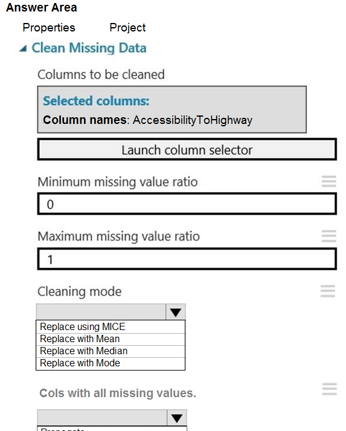
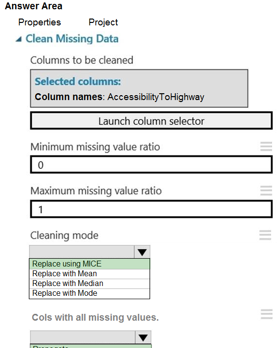

# Question 508

HOTSPOT -

You need to replace the missing data in the AccessibilityToHighway columns.

How should you configure the Clean Missing Data module? To answer, select the appropriate options in the answer area.

NOTE: Each correct selection is worth one point.

Hot Area:

  
Show Suggested Answer

 

Box 1: Replace using MICE -

Replace using MICE: For each missing value, this option assigns a new value, which is calculated by using a method described in the statistical literature as

&quot;Multivariate Imputation using Chained Equations&quot; or &quot;Multiple Imputation by Chained Equations&quot;. With a multiple imputation method, each variable with missing data is modeled conditionally using the other variables in the data before filling in the missing values.

Scenario: The AccessibilityToHighway column in both datasets contains missing values. The missing data must be replaced with new data so that it is modeled conditionally using the other variables in the data before filling in the missing values.

Box 2: Propagate -

Cols with all missing values indicate if columns of all missing values should be preserved in the output.

Reference:

https://docs.microsoft.com/en-us/azure/machine-learning/studio-module-reference/clean-missing-data

  
Show Discussions

<blockquote>
<strong>Svastaric</strong> <code>(Wed 28 Aug 2024 19:01)</code> - <em>Upvotes: 7</em>

I think it is in MICE definition. This method is imputing values that need to be distributed into empty column, instead of removing the columns and affecting dimensionality
</blockquote>
<blockquote>
<strong>Anandad12</strong> <code>(Sat 24 Aug 2024 04:42)</code> - <em>Upvotes: 6</em>

Cols with all missing data has default value of Remove. That is the correct answer to me. Not sure why Propagate?
</blockquote>

---

[<< Previous Question](question_507.md) | [Home](../index.md) | [Next Question >>](question_509.md)
