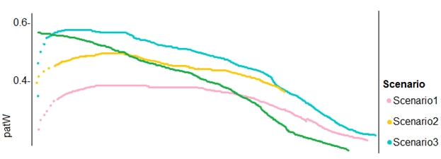

# Question 509

You need to implement a new cost factor scenario for the ad response models as illustrated in the performance curve exhibit.

Which technique should you use?

- A.Set the threshold to 0.5 and retrain if weighted Kappa deviates +/- 5% from 0.45.
- B.Set the threshold to 0.05 and retrain if weighted Kappa deviates +/- 5% from 0.5.
- C.Set the threshold to 0.2 and retrain if weighted Kappa deviates +/- 5% from 0.6.
- D.Set the threshold to 0.75 and retrain if weighted Kappa deviates +/- 5% from 0.15.

  
Show Suggested Answer

<strong>A</strong> 

Scenario:

Performance curves of current and proposed cost factor scenarios are shown in the following diagram:

 

The ad propensity model uses a cut threshold is 0.45 and retrains occur if weighted Kappa deviated from 0.1 +/- 5%.

  
Show Discussions

<blockquote>
<strong>michaelmorar</strong> <code>(Sun 16 Jun 2024 06:28)</code> - <em>Upvotes: 2</em>

Makes sense according to the provided explanation.
</blockquote>
<blockquote>
<strong>ning</strong> <code>(Mon 18 Dec 2023 14:06)</code> - <em>Upvotes: 1</em>

Kappa = (P0 - Pe) / (1 - Pe)
</blockquote>

---

[<< Previous Question](question_508.md) | [Home](../index.md) | [Next Question >>](question_510.md)
