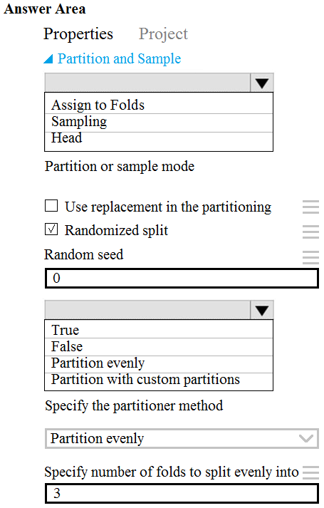
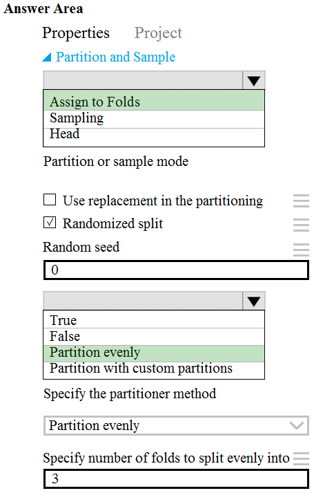

# Question 510

HOTSPOT -

You need to identify the methods for dividing the data according to the testing requirements.

Which properties should you select? To answer, select the appropriate options in the answer area.

NOTE: Each correct selection is worth one point.

Hot Area:

  
Show Suggested Answer

 

Scenario: Testing -

You must produce multiple partitions of a dataset based on sampling using the Partition and Sample module in Azure Machine Learning Studio.

Box 1: Assign to folds -

Use Assign to folds option when you want to divide the dataset into subsets of the data. This option is also useful when you want to create a custom number of folds for cross-validation, or to split rows into several groups.

Not Head: Use Head mode to get only the first n rows. This option is useful if you want to test a pipeline on a small number of rows, and don&#x27;t need the data to be balanced or sampled in any way.

Not Sampling: The Sampling option supports simple random sampling or stratified random sampling. This is useful if you want to create a smaller representative sample dataset for testing.

Box 2: Partition evenly -

Specify the partitioner method: Indicate how you want data to be apportioned to each partition, using these options:

✑ Partition evenly: Use this option to place an equal number of rows in each partition. To specify the number of output partitions, type a whole number in the

Specify number of folds to split evenly into text box.

Reference:

https://docs.microsoft.com/en-us/azure/machine-learning/algorithm-module-reference/partition-and-sample

  
Show Discussions

<blockquote>
<strong>Arend78</strong> <code>(Sun 23 Jun 2024 15:39)</code> - <em>Upvotes: 1</em>

&quot;You must create three equal partitions for cross-validation. You must also configure the cross-validation process so that the rows in the test and training datasets are divided evenly by properties that are near each city&#x27;s main river. You must complete this task before the data goes through the sampling process.&quot;

Considering &quot;divided evenly by properties that are near each city&#x27;s main river&quot;, shouldn&#x27;t the sampling process be stratified?

That would make the correct answer &quot;Partition with custom partitions&quot;?
</blockquote>

<blockquote>
<strong>michaelmorar</strong> <code>(Fri 23 Aug 2024 07:44)</code> - <em>Upvotes: 1</em>

Makes sense, but there doesn&#x27;t seem to be an option for custom partitioning based on a value a certain field value. Custom partition only allows us to play with the proportions in each split.

Stratified Split is not selectable in the question (not sure why)...

From Microsoft&#x27;s reference:

Partition with customized proportions: Use this option to specify the size of each partition as a comma-separated list.

For example, assume that you want to create three partitions. The first partition will contain 50 percent of the data. The remaining two partitions will each contain 25 percent of the data. In the List of proportions separated by comma box, enter these numbers: .5, .25, .25.
</blockquote>

<blockquote>
<strong>JTWang</strong> <code>(Fri 20 Oct 2023 02:53)</code> - <em>Upvotes: 2</em>

Partition evenly: Use this option to place an equal number of rows in each partition. To specify the number of output partitions, enter a whole number in the Specify number of folds to split evenly into box.

https://docs.microsoft.com/en-us/azure/machine-learning/component-reference/partition-and-sample#split-data-into-partitions
</blockquote>

---

[<< Previous Question](question_509.md) | [Home](/index.md) | [Next Question >>](question_511.md)
