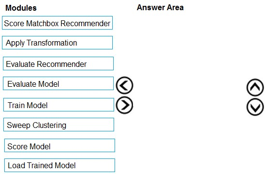
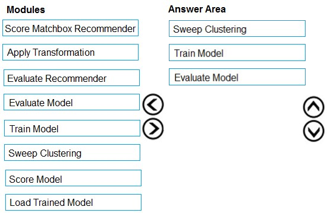

# Question 511

DRAG DROP -

You need to produce a visualization for the diagnostic test evaluation according to the data visualization requirements.

Which three modules should you recommend be used in sequence? To answer, move the appropriate modules from the list of modules to the answer area and arrange them in the correct order.

Select and Place:

  
Show Suggested Answer

 

Step 1: Sweep Clustering -

Start by using the &quot;Tune Model Hyperparameters&quot; module to select the best sets of parameters for each of the models we&#x27;re considering.

One of the interesting things about the &quot;Tune Model Hyperparameters&quot; module is that it not only outputs the results from the Tuning, it also outputs the Trained

Model.

Step 2: Train Model -

Step 3: Evaluate Model -

Scenario: You need to provide the test results to the Fabrikam Residences team. You create data visualizations to aid in presenting the results.

You must produce a Receiver Operating Characteristic (ROC) curve to conduct a diagnostic test evaluation of the model. You need to select appropriate methods for producing the ROC curve in Azure Machine Learning Studio to compare the Two-Class Decision Forest and the Two-Class Decision Jungle modules with one another.

Reference:

http://breaking-bi.blogspot.com/2017/01/azure-machine-learning-model-evaluation.html

  
Show Discussions

<blockquote>
<strong>hendrata</strong> <code>(Fri 09 Jun 2023 19:33)</code> - <em>Upvotes: 35</em>

Agree with the comments above. I think it should be:
1. Load Trained Model
2. Evaluate Model
3. Score Model
</blockquote>
<blockquote>
<strong>a_1234567_</strong> <code>(Thu 27 Jul 2023 09:14)</code> - <em>Upvotes: 88</em>

Why not this sequence?
1. Load Trained Model
2. Score Model 
3. Evaluate Model
</blockquote>
<blockquote>
<strong>kty</strong> <code>(Mon 25 Mar 2024 19:36)</code> - <em>Upvotes: 13</em>

how can it be possible to evaluate before scoring?
</blockquote>
<blockquote>
<strong>Rajuuu</strong> <code>(Thu 10 Aug 2023 11:56)</code> - <em>Upvotes: 25</em>

1. Load Trained Model 2. Score Model  3. Evaluate Model
</blockquote>
<blockquote>
<strong>wikasitha</strong> <code>(Thu 29 Aug 2024 15:03)</code> - <em>Upvotes: 4</em>

correct answer might be 
Train &gt; score &gt; evaluate
</blockquote>
<blockquote>
<strong>rjile</strong> <code>(Mon 11 Dec 2023 10:30)</code> - <em>Upvotes: 11</em>

Creating the Experiment
Add the following modules to your workspace in Azure Machine Learning Studio (classic):

Adult Census Income Binary Classification dataset
Two-Class Logistic Regression
Train Model
Score Model
Evaluate Model

so --&gt; Train Model, Score Model, Evaluate Model

https://docs.microsoft.com/en-us/azure/machine-learning/classic/evaluate-model-performance
</blockquote>

<blockquote>
<strong>conniekdl</strong> <code>(Fri 28 Jul 2023 13:41)</code> - <em>Upvotes: 1</em>

It seems that there&#x27;s no module for Loading Trained Model in the designer, but one in the studio. Maybe that&#x27;s why the first should be Load Trained Model.
https://docs.microsoft.com/en-us/azure/machine-learning/algorithm-module-reference/module-reference
</blockquote>
<blockquote>
<strong>davo123</strong> <code>(Sat 20 May 2023 09:56)</code> - <em>Upvotes: 3</em>

Why not &#x27;Score Model&#x27; instead of &#x27;Train Model&#x27;? References show that &#x27;Train Model&#x27; is not necessary here.
</blockquote>
<blockquote>
<strong>choolake</strong> <code>(Fri 19 May 2023 05:34)</code> - <em>Upvotes: 4</em>

Two-Class Decision Jungle and Two-Class Decision Forest are classification Models
cant use sweep clustering module which is for clustering
</blockquote>

---

[<< Previous Question](question_510.md) | [Home](../index.md) | [Next Question >>](question_512.md)
