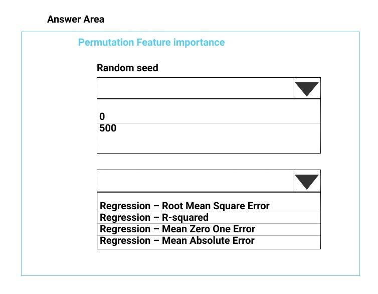
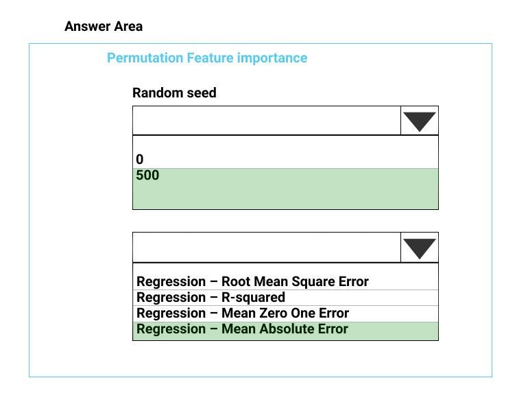

# Question 513

HOTSPOT -

You need to configure the Permutation Feature Importance module for the model training requirements.

What should you do? To answer, select the appropriate options in the dialog box in the answer area.

NOTE: Each correct selection is worth one point.

Hot Area:

  
Show Suggested Answer

 

Box 1: 500 -

For Random seed, type a value to use as seed for randomization. If you specify 0 (the default), a number is generated based on the system clock.

A seed value is optional, but you should provide a value if you want reproducibility across runs of the same experiment.

Here we must replicate the findings.

Box 2: Mean Absolute Error -

Scenario: Given a trained model and a test dataset, you must compute the Permutation Feature Importance scores of feature variables. You need to set up the

Permutation Feature Importance module to select the correct metric to investigate the model&#x27;s accuracy and replicate the findings.

Regression. Choose one of the following: Precision, Recall, Mean Absolute Error, Root Mean Squared Error, Relative Absolute Error, Relative Squared Error,

Coefficient of Determination -

Reference:

https://docs.microsoft.com/en-us/azure/machine-learning/studio-module-reference/permutation-feature-importance

  
Show Discussions

<blockquote>
<strong>podval</strong> <code>(Thu 08 Jul 2021 15:59)</code> - <em>Upvotes: 23</em>

RMSE indicates the absolute fit of the model to the data–how close the observed data points are to the model&#x27;s predicted values. Whereas R-squared is a relative measure of fit, RMSE is an absolute measure of fit. See: &quot;You must be determined the absolute fit of the model&quot;.
</blockquote>
<blockquote>
<strong>Zhuo</strong> <code>(Mon 17 May 2021 19:02)</code> - <em>Upvotes: 16</em>

Mean Absolute Error , Root Mean Squared Error, r- squared are all correct.
</blockquote>
<blockquote>
<strong>Mckay_</strong> <code>(Sat 14 Oct 2023 22:44)</code> - <em>Upvotes: 2</em>

MAE seems like the best choice since RMSE is more sensitive to outlier.
</blockquote>
<blockquote>
<strong>[Removed]</strong> <code>(Tue 02 May 2023 03:56)</code> - <em>Upvotes: 5</em>

MAE is correct. RMSE has the benefit of penalizing large errors more so can be more appropriate in some cases, for example, if being off by 10 is more than twice as bad as being off by 5. But if being off by 10 is just twice as bad as being off by 5, then MAE is more appropriate.
From an interpretation standpoint, MAE is clearly the winner. RMSE does not describe average error alone and has other implications that are more difficult to tease out and understand.
On the other hand, one distinct advantage of RMSE over MAE is that RMSE avoids the use of taking the absolute value, which is undesirable in many mathematical calculations.
</blockquote>
<blockquote>
<strong>BTAB</strong> <code>(Mon 15 Jan 2024 14:10)</code> - <em>Upvotes: 1</em>

Excellent evaluation and I concur.  Going with MAE.
</blockquote>
<blockquote>
<strong>Zwi3b3l</strong> <code>(Thu 24 Feb 2022 17:36)</code> - <em>Upvotes: 2</em>

Should be RMSE. 
https://www.theanalysisfactor.com/assessing-the-fit-of-regression-models/
</blockquote>
<blockquote>
<strong>Alexandra</strong> <code>(Mon 05 Jul 2021 11:47)</code> - <em>Upvotes: 2</em>

if the findings should be replicated, than the seed should be 0
also another question for this case study had r-squared as correct evaluation method for regression model...
</blockquote>
<blockquote>
<strong>111ssy</strong> <code>(Fri 03 Dec 2021 20:59)</code> - <em>Upvotes: 11</em>

If it is 0, the seed is generated by the system clock meaning that it won&#x27;t be replicable and keep changing like the time, hence would be 500?
</blockquote>
<blockquote>
<strong>phdykd</strong> <code>(Fri 09 Aug 2024 19:05)</code> - <em>Upvotes: 1</em>

where does it ask to be replicable?
</blockquote>

---

[<< Previous Question](question_512.md) | [Home](../index.md) | [Next Question >>](question_514.md)
