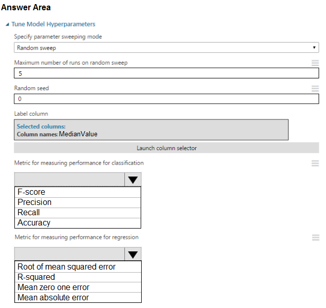
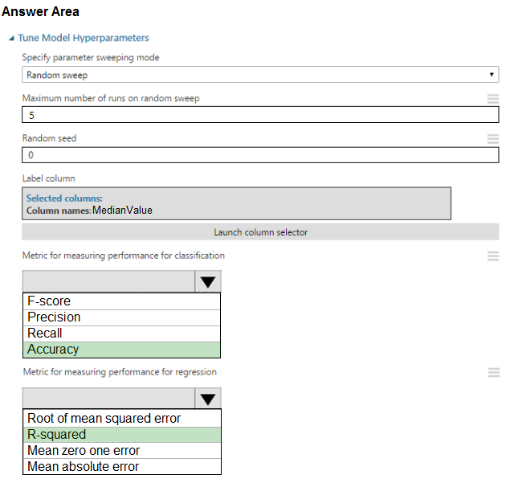

# Question 516

HOTSPOT -

You need to set up the Permutation Feature Importance module according to the model training requirements.

Which properties should you select? To answer, select the appropriate options in the answer area.

NOTE: Each correct selection is worth one point.

Hot Area:

  
Show Suggested Answer

 

Box 1: Accuracy -

Scenario: You want to configure hyperparameters in the model learning process to speed the learning phase by using hyperparameters. In addition, this configuration should cancel the lowest performing runs at each evaluation interval, thereby directing effort and resources towards models that are more likely to be successful.

Box 2: R-Squared

  
Show Discussions

<blockquote>
<strong>Alexandra</strong> <code>(Wed 05 Jan 2022 12:39)</code> - <em>Upvotes: 18</em>

because it is required to produce ROC curve, I think f-score is the correct answer for the classification task
</blockquote>
<blockquote>
<strong>spaceykacey</strong> <code>(Fri 12 May 2023 07:49)</code> - <em>Upvotes: 1</em>

yes but why R2 as measure of performance?
</blockquote>
<blockquote>
<strong>hendrata</strong> <code>(Thu 09 Dec 2021 20:45)</code> - <em>Upvotes: 6</em>

Why would we select Accuracy? This is a regression problem and not a classification problem, I would have thought we only need to select one of the answers in the regression box only.
</blockquote>
<blockquote>
<strong>dev2dev</strong> <code>(Tue 20 Sep 2022 12:42)</code> - <em>Upvotes: 1</em>

this is indeed classification. check option again
</blockquote>
<blockquote>
<strong>phdykd</strong> <code>(Sun 25 Aug 2024 23:46)</code> - <em>Upvotes: 1</em>

For the Permutation Feature Importance module, the following metrics should be selected for measuring performance:

Metric for measuring performance for classification:

A) F-Score
Metric for measuring performance for regression:

D) MAE or A) RMSE (depending on the specific requirements of the model training)
</blockquote>

<blockquote>
<strong>JJason</strong> <code>(Tue 23 May 2023 08:34)</code> - <em>Upvotes: 3</em>

why not RMSE?
</blockquote>
<blockquote>
<strong>Abhinav_nasaiitkgp</strong> <code>(Thu 21 Jul 2022 20:09)</code> - <em>Upvotes: 4</em>

Completely weird options as for classification we can use precision, recall and F score and Accuracy. Any option is not wrong.
</blockquote>
<blockquote>
<strong>swatidorge</strong> <code>(Thu 12 May 2022 08:18)</code> - <em>Upvotes: 1</em>

why not precision for classifications?
</blockquote>
<blockquote>
<strong>geraldhermannerich</strong> <code>(Fri 04 Mar 2022 13:38)</code> - <em>Upvotes: 1</em>

Isn&#x27;t MAE a continous metric, hence not applicable here?
</blockquote>

---

[<< Previous Question](question_515.md) | [Home](/index.md) | [Next Question >>](question_517.md)
