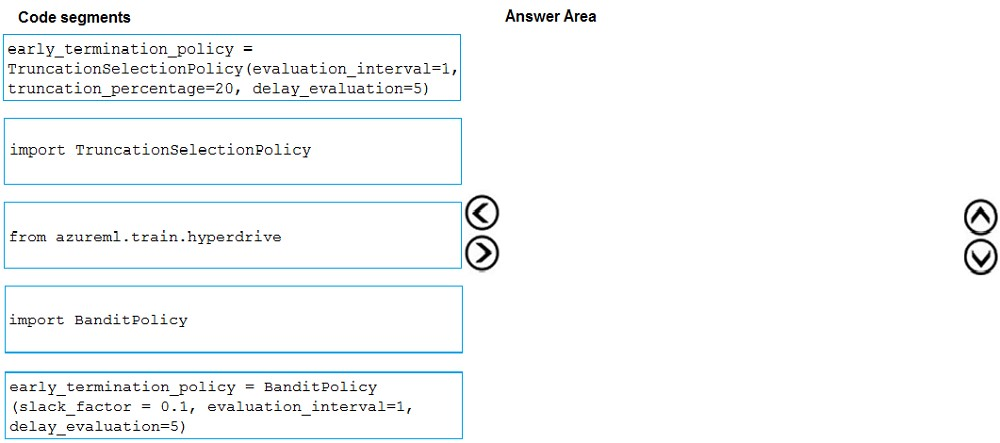

# Question 519

DRAG DROP -

You need to implement an early stopping criteria policy for model training.

Which three code segments should you use to develop the solution? To answer, move the appropriate code segments from the list of code segments to the answer area and arrange them in the correct order.

NOTE: More than one order of answer choices is correct. You will receive credit for any of the correct orders you select.

Select and Place:

  
Show Suggested Answer

 

You need to implement an early stopping criterion on models that provides savings without terminating promising jobs.

Truncation selection cancels a given percentage of lowest performing runs at each evaluation interval. Runs are compared based on their performance on the primary metric and the lowest X% are terminated.

Example:

from azureml.train.hyperdrive import TruncationSelectionPolicy early_termination_policy = TruncationSelectionPolicy(evaluation_interval=1, truncation_percentage=20, delay_evaluation=5)

Incorrect Answers:

Bandit is a termination policy based on slack factor/slack amount and evaluation interval. The policy early terminates any runs where the primary metric is not within the specified slack factor / slack amount with respect to the best performing training run.

Example:

from azureml.train.hyperdrive import BanditPolicy

early_termination_policy = BanditPolicy(slack_factor = 0.1, evaluation_interval=1, delay_evaluation=5

Reference:

https://docs.microsoft.com/en-us/azure/machine-learning/service/how-to-tune-hyperparameters

  
Show Discussions

<blockquote>
<strong>james2033</strong> <code>(Sat 12 Oct 2024 04:46)</code> - <em>Upvotes: 1</em>

Code snippet in structure with 3 steps:
1) from ...
2) import ...
3) call method

Has only &quot;from....&quot; from choices list --&gt; choose &quot;from azureml.train.hyperdrive&quot; without any afraid. Next, &quot;BanditPolicy&quot; or &quot;&quot;TruncationSelectionPolicy&quot;? all of two for &quot;early termination policy&quot;.

https://learn.microsoft.com/en-us/python/api/azureml-train-core/azureml.train.hyperdrive.banditpolicy?view=azure-ml-py

https://learn.microsoft.com/en-us/python/api/azureml-train-core/azureml.train.hyperdrive.truncationselectionpolicy?view=azure-ml-py

Keywords in the question &quot;must implement an early stopping criterion on models that provides savings without terminating promising jobs.&quot; SAVING WITHOUT TERMINATING PROMISSING JOBS. See comparig from Google Bard https://g.co/bard/share/09f818b51866 . Choose TruncationSeclectionPloicy
</blockquote>

<blockquote>
<strong>phdykd</strong> <code>(Mon 26 Feb 2024 02:19)</code> - <em>Upvotes: 3</em>

from azureml.train.hyperdrive, import BanditPolicy, early_termination_policy= BanditPolicy().

TruncationSelectionPolicy does have an option to cancel the lowest performing runs. However, this policy does not take into account the performance of previous runs, so it may not be the most effective early stopping policy. The policy simply cancels runs if their performance falls below a certain threshold.

In contrast, the BanditPolicy considers the performance of previous runs when deciding which runs to stop early. It uses a Bayesian approach to estimate the best performing configuration and stops runs that are unlikely to perform better than the current best configuration. This makes it a more effective early stopping policy in many cases.

So while the TruncationSelectionPolicy may be a valid option for some situations, the BanditPolicy is generally a better choice for implementing an effective early stopping policy.
</blockquote>

<blockquote>
<strong>Lucario95</strong> <code>(Thu 19 May 2022 07:37)</code> - <em>Upvotes: 1</em>

Could anyone explain why the correct answer is Truncation instead of Bandit policy?
</blockquote>
<blockquote>
<strong>prashantjoge</strong> <code>(Sat 28 May 2022 19:59)</code> - <em>Upvotes: 4</em>

For a conservative policy that provides savings without terminating promising jobs, consider a Median Stopping Policy with evaluation_interval 1 and delay_evaluation 5. These are conservative settings, that can provide approximately 25%-35% savings with no loss on primary metric (based on our evaluation data).
For more aggressive savings, use Bandit Policy with a smaller allowable slack or Truncation Selection Policy with a larger truncation percentage.
</blockquote>
<blockquote>
<strong>audun</strong> <code>(Tue 04 Apr 2023 09:08)</code> - <em>Upvotes: 2</em>

it says &quot;NOTE: More than one order of answer choices is correct.&quot; considering there&#x27;s really only two combinations that would work we can assume both are correct
</blockquote>
<blockquote>
<strong>azure1000</strong> <code>(Sat 06 Aug 2022 06:32)</code> - <em>Upvotes: 4</em>

Because question says &quot;this configuration should cancel the lowest performing runs&quot;, which only happens in truncation
</blockquote>
<blockquote>
<strong>lcgcastro96</strong> <code>(Sat 29 Jun 2024 16:49)</code> - <em>Upvotes: 1</em>

wdym? Bandit Policy cancels runs whose best results fall below a certain mark (related with the goal and the slack factor), so it also does that.

Besides that, Truncation will stop runs that fall below a certain threshold right away, going against the requirement of the case study which reinforces that promising runs should not be terminated
</blockquote>

<blockquote>
<strong>lcgcastro96</strong> <code>(Sat 29 Jun 2024 16:52)</code> - <em>Upvotes: 1</em>

PS - I understand that the main core of Truncation is canceling the lowest performing runs per se, my point is just that Bandit Policy also does it but &quot;less blindly&quot; if this makes sense, so the possible solution can be either imo
</blockquote>
<blockquote>
<strong>silva_831</strong> <code>(Wed 22 Nov 2023 03:58)</code> - <em>Upvotes: 1</em>

You&#x27;re right. This phrase was mentioned in the section Hyperparameter.
</blockquote>

---

[<< Previous Question](question_518.md) | [Home](../index.md) | [Next Question >>](question_520.md)
