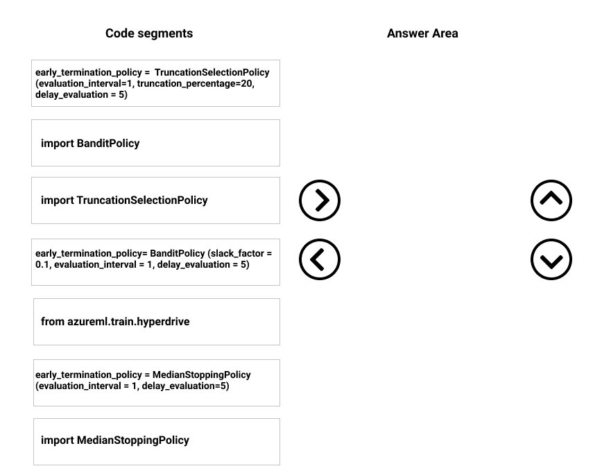
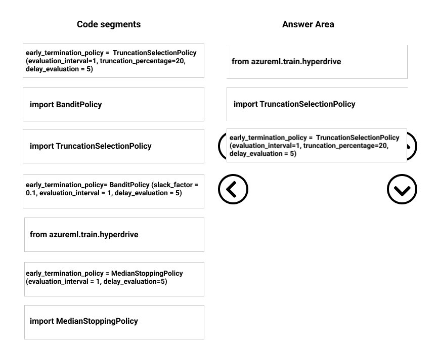

# Question 520

DRAG DROP -

You need to implement early stopping criteria as stated in the model training requirements.

Which three code segments should you use to develop the solution? To answer, move the appropriate code segments from the list of code segments to the answer area and arrange them in the correct order.

NOTE: More than one order of answer choices is correct. You will receive the credit for any of the correct orders you select.

Select and Place:

  
Show Suggested Answer

 

Step 1: from azureml.train.hyperdrive

Step 2: Import TruncationCelectionPolicy

Truncation selection cancels a given percentage of lowest performing runs at each evaluation interval. Runs are compared based on their performance on the primary metric and the lowest X% are terminated.

Scenario: You must configure hyperparameters in the model learning process to speed the learning phase. In addition, this configuration should cancel the lowest performing runs at each evaluation interval, thereby directing effort and resources towards models that are more likely to be successful.

Step 3: early_terminiation_policy = TruncationSelectionPolicy..

Example:

from azureml.train.hyperdrive import TruncationSelectionPolicy early_termination_policy = TruncationSelectionPolicy(evaluation_interval=1, truncation_percentage=20, delay_evaluation=5)

In this example, the early termination policy is applied at every interval starting at evaluation interval 5. A run will be terminated at interval 5 if its performance at interval 5 is in the lowest 20% of performance of all runs at interval 5.

Incorrect Answers:

Median:

Median stopping is an early termination policy based on running averages of primary metrics reported by the runs. This policy computes running averages across all training runs and terminates runs whose performance is worse than the median of the running averages.

Slack:

Bandit is a termination policy based on slack factor/slack amount and evaluation interval. The policy early terminates any runs where the primary metric is not within the specified slack factor / slack amount with respect to the best performing training run.

Reference:

https://docs.microsoft.com/en-us/azure/machine-learning/service/how-to-tune-hyperparameters

  
Show Discussions

<blockquote>
<strong>yobllip</strong> <code>(Tue 21 Jun 2022 02:43)</code> - <em>Upvotes: 5</em>

The case study is about cancel the lowest performing runs at each evaluation interval (Hyperparameters). So, using &quot;Truncation selection policy&quot; is correct answer
</blockquote>
<blockquote>
<strong>james2033</strong> <code>(Sat 12 Oct 2024 04:56)</code> - <em>Upvotes: 1</em>

Question&#x27;s keyword &quot;Therefore, must implement an early stopping criterion on models that provides savings without terminating promising jobs.&quot; So choose 2nd block what is &quot;TruncationSelectionPolicy&quot; .
</blockquote>
<blockquote>
<strong>phdykd</strong> <code>(Mon 26 Feb 2024 02:34)</code> - <em>Upvotes: 2</em>

In this case, the Bandit policy would be the more appropriate selection. The Bandit policy is designed to balance exploration (trying out different hyperparameters) and exploitation (using the best hyperparameters found so far) while taking into account the efficiency of resource utilization. The Bandit policy is suitable when there are limited computational resources available and when there is a need to terminate low-performing runs early.
</blockquote>
<blockquote>
<strong>synapse</strong> <code>(Thu 16 Mar 2023 15:46)</code> - <em>Upvotes: 1</em>

Super long question for a simple problem. All you need to know is this:
You must configure hyperparameters in the model learning process to speed the learning phase. In addition, this configuration should cancel the lowest performing runs at each evaluation interval, thereby directing effort and resources towards models that are more likely to be successful.
You are concerned that the model might not efficiently use compute resources in hyperparameter tuning. You also are concerned that the model might prevent an increase in the overall tuning time. Therefore, must implement an early stopping criterion on models that provides savings without terminating promising jobs.
Answer: Selection Truncation policy.  As delay_evaluation is already set in all 3 answers, that&#x27;s not a factor.
</blockquote>
<blockquote>
<strong>hargur</strong> <code>(Tue 11 Oct 2022 14:45)</code> - <em>Upvotes: 1</em>

has anyone seen such question recently in exam
</blockquote>
<blockquote>
<strong>Lucario95</strong> <code>(Thu 19 May 2022 07:44)</code> - <em>Upvotes: 1</em>

I agree with medianStopping as referred to the answer&#x27;s link
</blockquote>
<blockquote>
<strong>saurabhk1</strong> <code>(Tue 08 Mar 2022 13:53)</code> - <em>Upvotes: 4</em>

I think, the policy should be the MedianTerminationPolicy,

For a conservative policy that provides savings without terminating promising jobs, consider a Median Stopping Policy with evaluation_interval 1 and delay_evaluation 5. These are conservative settings, that can provide approximately 25%-35% savings with no loss on primary metric (based on our evaluation data).
</blockquote>

<blockquote>
<strong>audun</strong> <code>(Tue 04 Apr 2023 09:11)</code> - <em>Upvotes: 1</em>

the question states that &quot;NOTE: More than one order of answer choices is correct. &quot; so that can be true simulatenous with TruncationSelectionPolicy
</blockquote>

---

[<< Previous Question](question_519.md) | [Home](../index.md) | [Next Question >>](question_521.md)
