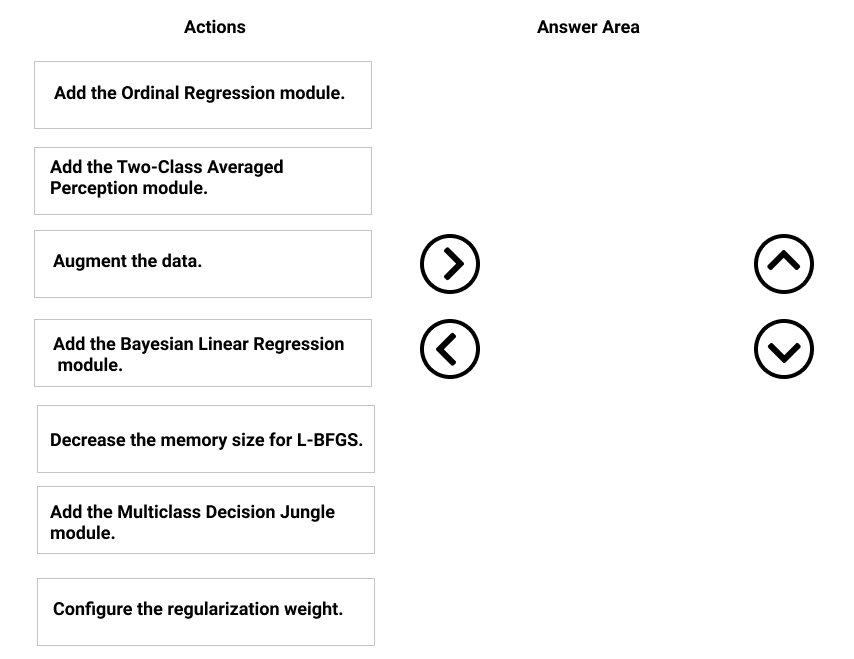
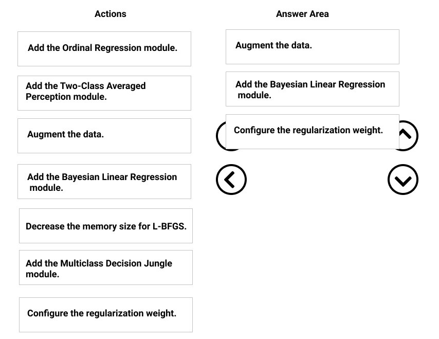

# Question 521

DRAG DROP -

You need to correct the model fit issue.

Which three actions should you perform in sequence? To answer, move the appropriate actions from the list of actions to the answer area and arrange them in the correct order.

Select and Place:

  
Show Suggested Answer

 

Step 1: Augment the data -

Scenario: Columns in each dataset contain missing and null values. The datasets also contain many outliers.

Step 2: Add the Bayesian Linear Regression module.

Scenario: You produce a regression model to predict property prices by using the Linear Regression and Bayesian Linear Regression modules.

Step 3: Configure the regularization weight.

Regularization typically is used to avoid overfitting. For example, in L2 regularization weight, type the value to use as the weight for L2 regularization. We recommend that you use a non-zero value to avoid overfitting.

Scenario:

Model fit: The model shows signs of overfitting. You need to produce a more refined regression model that reduces the overfitting.

Incorrect Answers:

Multiclass Decision Jungle module:

Decision jungles are a recent extension to decision forests. A decision jungle consists of an ensemble of decision directed acyclic graphs (DAGs).

L-BFGS:

L-BFGS stands for &quot;limited memory Broyden-Fletcher-Goldfarb-Shanno&quot;. It can be found in the wwo-Class Logistic Regression module, which is used to create a logistic regression model that can be used to predict two (and only two) outcomes.

Reference:

https://docs.microsoft.com/en-us/azure/machine-learning/studio-module-reference/linear-regression

  
Show Discussions

<blockquote>
<strong>james2033</strong> <code>(Sat 12 Oct 2024 04:55)</code> - <em>Upvotes: 1</em>

Question keyword &quot;You produce a regression model to predict property prices by using the Linear Regression and Bayesian Linear Regression modules.&quot; --&gt; 
First block, sure for &quot;Augment the data&quot;.
Third block, sure for &quot;Configure the regulation weight.&quot;
remain part, Second block, choose &quot;Add the Bayesian Linear Regression module&quot; based on question&#x27;s keyword.
</blockquote>
<blockquote>
<strong>phdykd</strong> <code>(Mon 26 Feb 2024 02:46)</code> - <em>Upvotes: 1</em>

given answer is ok
</blockquote>
<blockquote>
<strong>phdykd</strong> <code>(Mon 26 Feb 2024 02:46)</code> - <em>Upvotes: 3</em>

Augment the data to increase the size of the training set and potentially improve the model&#x27;s ability to capture patterns in the data.
Add the Bayesian linear regression module, which may provide a better fit for the data than the standard linear regression module.
Configure the regularization weight to help prevent overfitting and improve generalization performance.
</blockquote>
<blockquote>
<strong>phdykd</strong> <code>(Mon 26 Feb 2024 02:43)</code> - <em>Upvotes: 1</em>

Augment the data: This can help to increase the size and diversity of the training data, which may improve the performance of the model.

Configure the regularization weight: Regularization can help to prevent overfitting by adding a penalty term to the loss function. Adjusting the regularization weight can help to find an optimal balance between model complexity and generalization.

Decrease the memory size for L-BFGS: This can help to reduce the computational resources required for training the model, which can improve the efficiency and speed of the training process.

Adding the other modules (ordinal regression, two-class averaged perception, multiclass decision jungle) would not be appropriate for a regression problem, and adding the Bayesian Linear Regression module was already mentioned in the scenario.
</blockquote>

<blockquote>
<strong>azure1000</strong> <code>(Sat 06 Aug 2022 06:40)</code> - <em>Upvotes: 3</em>

Augmentation and regularization is correct. but not sure for Bayesian model
</blockquote>
<blockquote>
<strong>azayra</strong> <code>(Fri 28 Oct 2022 16:38)</code> - <em>Upvotes: 1</em>

You must set up the experiment to cross-validate the Linear Regression and Bayesian Linear Regression modules to evaluate performance.
</blockquote>
<blockquote>
<strong>mangeshb1981</strong> <code>(Fri 12 Aug 2022 11:28)</code> - <em>Upvotes: 1</em>

What should be the answer then?
</blockquote>

---

[<< Previous Question](question_520.md) | [Home](../index.md)
