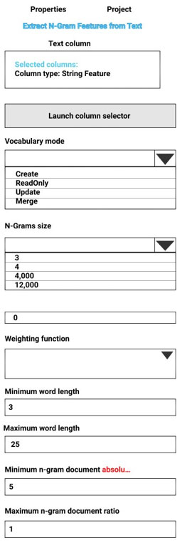
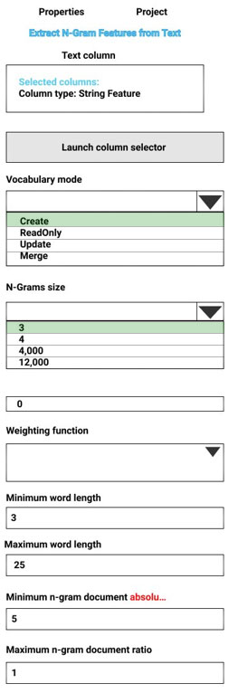

# Question 54

HOTSPOT -

You are performing sentiment analysis using a CSV file that includes 12,000 customer reviews written in a short sentence format. You add the CSV file to Azure

Machine Learning Studio and configure it as the starting point dataset of an experiment. You add the Extract N-Gram Features from Text module to the experiment to extract key phrases from the customer review column in the dataset.

You must create a new n-gram dictionary from the customer review text and set the maximum n-gram size to trigrams.

What should you select? To answer, select the appropriate options in the answer area.

NOTE: Each correct selection is worth one point.

Hot Area:

  
Show Suggested Answer

 

Vocabulary mode: Create -

For Vocabulary mode, select Create to indicate that you are creating a new list of n-gram features.

N-Grams size: 3 -

For N-Grams size, type a number that indicates the maximum size of the n-grams to extract and store. For example, if you type 3, unigrams, bigrams, and trigrams will be created.

Weighting function: Leave blank -

The option, Weighting function, is required only if you merge or update vocabularies. It specifies how terms in the two vocabularies and their scores should be weighted against each other.

Reference:

https://docs.microsoft.com/en-us/azure/machine-learning/studio-module-reference/extract-n-gram-features-from-text

  
Show Discussions

<blockquote>
<strong>ashii007</strong> <code>(Mon 20 Dec 2021 07:42)</code> - <em>Upvotes: 5</em>

vocab = create
ngram = 3
</blockquote>
<blockquote>
<strong>Roger_Sampaio1</strong> <code>(Thu 23 Nov 2023 02:12)</code> - <em>Upvotes: 1</em>

Resposta:

1. Vocabulary mode: Criar.
2. N-Grams size: 3. Já que a questão diz trigrama. Isso é o tamanho máximo das palavras-chaves.
</blockquote>
<blockquote>
<strong>Sadhak</strong> <code>(Sun 17 Nov 2024 13:18)</code> - <em>Upvotes: 1</em>

English: 2. N-Grams size: 3. Since the question says trigram. This is the maximum keyword length.
</blockquote>
<blockquote>
<strong>ning</strong> <code>(Tue 24 May 2022 17:26)</code> - <em>Upvotes: 1</em>

Weighted function, you have to select one when creating n-gram, just tested in azure ml studio
</blockquote>
<blockquote>
<strong>manvel</strong> <code>(Sun 12 Feb 2023 13:26)</code> - <em>Upvotes: 3</em>

Per documentation, The option, Weighting function, is required only if you merge or update vocabularies. So no need to select an option here
</blockquote>

---

[<< Previous Question](question_53.md) | [Home](/index.md) | [Next Question >>](question_55.md)
