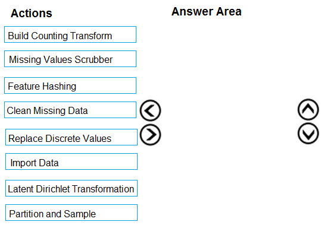
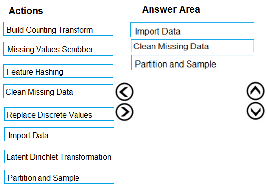

# Question 57

DRAG DROP -

You are creating an experiment by using Azure Machine Learning Studio.

You must divide the data into four subsets for evaluation. There is a high degree of missing values in the data. You must prepare the data for analysis.

You need to select appropriate methods for producing the experiment.

Which three modules should you run in sequence? To answer, move the appropriate actions from the list of actions to the answer area and arrange them in the correct order.

NOTE: More than one order of answer choices is correct. You will receive credit for any of the correct orders you select.

Select and Place:

  
Show Suggested Answer

 

The Clean Missing Data module in Azure Machine Learning Studio, to remove, replace, or infer missing values.

Incorrect Answers:

✑ Latent Direchlet Transformation: Latent Dirichlet Allocation module in Azure Machine Learning Studio, to group otherwise unclassified text into a number of categories. Latent Dirichlet Allocation (LDA) is often used in natural language processing (NLP) to find texts that are similar. Another common term is topic modeling.

✑ Build Counting Transform: Build Counting Transform module in Azure Machine Learning Studio, to analyze training data. From this data, the module builds a count table as well as a set of count-based features that can be used in a predictive model.

Missing Value Scrubber: The Missing Values Scrubber module is deprecated.

 

✑ Feature hashing: Feature hashing is used for linguistics, and works by converting unique tokens into integers.

✑ Replace discrete values: the Replace Discrete Values module in Azure Machine Learning Studio is used to generate a probability score that can be used to represent a discrete value. This score can be useful for understanding the information value of the discrete values.

Reference:

https://docs.microsoft.com/en-us/azure/machine-learning/studio-module-reference/clean-missing-data

  
Show Discussions

<blockquote>
<strong>ougullamaija</strong> <code>(Wed 19 Oct 2022 20:18)</code> - <em>Upvotes: 19</em>

Correct as f*uck.
</blockquote>
<blockquote>
<strong>NullVoider_0</strong> <code>(Mon 12 Aug 2024 13:30)</code> - <em>Upvotes: 1</em>

On exam 12-02-2024.
</blockquote>
<blockquote>
<strong>ZIMARAKI</strong> <code>(Sat 02 Sep 2023 17:13)</code> - <em>Upvotes: 2</em>

correct
</blockquote>
<blockquote>
<strong>azurelearner666</strong> <code>(Mon 10 Oct 2022 13:52)</code> - <em>Upvotes: 2</em>

correct!
</blockquote>
<blockquote>
<strong>hargur</strong> <code>(Wed 20 Apr 2022 09:40)</code> - <em>Upvotes: 4</em>

on 19Oct2021
</blockquote>
<blockquote>
<strong>Akki0120</strong> <code>(Tue 04 Jan 2022 17:08)</code> - <em>Upvotes: 1</em>

If anyone wants all questions ping me 9403778084
</blockquote>

---

[<< Previous Question](question_56.md) | [Home](../index.md) | [Next Question >>](question_58.md)
