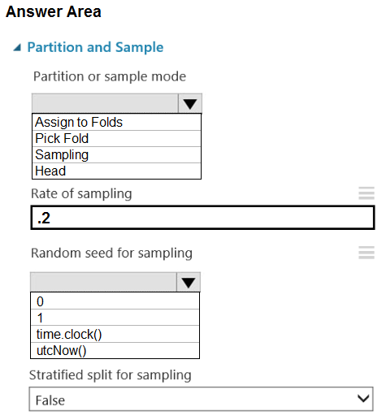
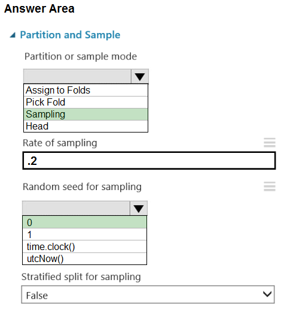

# Question 59

HOTSPOT -

You are retrieving data from a large datastore by using Azure Machine Learning Studio.

You must create a subset of the data for testing purposes using a random sampling seed based on the system clock.

You add the Partition and Sample module to your experiment.

You need to select the properties for the module.

Which values should you select? To answer, select the appropriate options in the answer area.

NOTE: Each correct selection is worth one point.

Hot Area:

  
Show Suggested Answer

 

Box 1: Sampling -

Create a sample of data -

This option supports simple random sampling or stratified random sampling. This is useful if you want to create a smaller representative sample dataset for testing.

1. Add the Partition and Sample module to your experiment in Studio, and connect the dataset.

2. Partition or sample mode: Set this to Sampling.

3. Rate of sampling. See box 2 below.

Box 2: 0 -

3. Rate of sampling. Random seed for sampling: Optionally, type an integer to use as a seed value.

This option is important if you want the rows to be divided the same way every time. The default value is 0, meaning that a starting seed is generated based on the system clock. This can lead to slightly different results each time you run the experiment.

Reference:

https://docs.microsoft.com/en-us/azure/machine-learning/studio-module-reference/partition-and-sample

  
Show Discussions

<blockquote>
<strong>BilJon</strong> <code>(Mon 28 Mar 2022 17:45)</code> - <em>Upvotes: 22</em>

Random seed for sampling: Optionally, type an integer to use as a seed value.

This option is important if you want the rows to be divided the same way every time. The default value is 0, meaning that a starting seed is generated based on the system clock. This can lead to slightly different results each time you run the experiment.

https://docs.microsoft.com/en-us/azure/machine-learning/studio-module-reference/partition-and-sample
</blockquote>

<blockquote>
<strong>David_Tadeu</strong> <code>(Wed 22 Mar 2023 14:42)</code> - <em>Upvotes: 10</em>

So they just had the option time.clock() to trick us into failing?
</blockquote>
<blockquote>
<strong>Hisayuki</strong> <code>(Sun 03 Nov 2024 09:22)</code> - <em>Upvotes: 1</em>

time.clock() - Trick us. Microsoft learning says &quot;This option is important if you want the rows to be divided the same way every time. The default value is 0, meaning that a starting seed is generated based on the system clock.&quot;
</blockquote>
<blockquote>
<strong>ning</strong> <code>(Thu 11 May 2023 11:45)</code> - <em>Upvotes: 2</em>

correct! 0 --&gt; system clock, random sampling not stratified sampling
</blockquote>
<blockquote>
<strong>dzzz</strong> <code>(Wed 15 Dec 2021 12:40)</code> - <em>Upvotes: 5</em>

The question says &quot;a random sampling seed based on the system clock&quot;. 
I believe that implies the 2nd drop down is time.clock() - machine time.
</blockquote>
<blockquote>
<strong>damirbek369</strong> <code>(Mon 20 Dec 2021 12:17)</code> - <em>Upvotes: 17</em>

I think, &quot;0&quot; is a correct answer. Because the value to enter should be an integer. And look here as well: Random seed for sampling: Optionally, enter an integer to use as a seed value.

This option is important if you want the rows to be divided the same way every time. The default value is 0, meaning that a starting seed is generated based on the system clock. This value can lead to slightly different results each time you run the pipeline.

https://docs.microsoft.com/en-us/azure/machine-learning/algorithm-module-reference/partition-and-sample
</blockquote>

<blockquote>
<strong>synapse</strong> <code>(Mon 13 Mar 2023 11:24)</code> - <em>Upvotes: 6</em>

there&#x27;s no such option as time.clock(). 0 is the correct answer.
</blockquote>

---

[<< Previous Question](question_58.md) | [Home](../index.md) | [Next Question >>](question_60.md)
