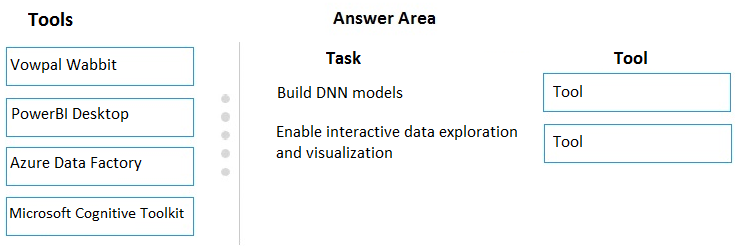
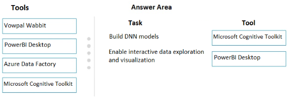

# Question 60

DRAG DROP -

You configure a Deep Learning Virtual Machine for Windows.

You need to recommend tools and frameworks to perform the following:

✑ Build deep neural network (DNN) models

✑ Perform interactive data exploration and visualization

Which tools and frameworks should you recommend? To answer, drag the appropriate tools to the correct tasks. Each tool may be used once, more than once, or not at all. You may need to drag the split bar between panes or scroll to view content.

NOTE: Each correct selection is worth one point.

Select and Place:

  
Show Suggested Answer

 

  
Show Discussions

<blockquote>
<strong>jameswoo</strong> <code>(Sat 14 Nov 2020 16:31)</code> - <em>Upvotes: 35</em>

I think it should be Microsoft Cognitive Kit for DNN.
</blockquote>
<blockquote>
<strong>sakshi239</strong> <code>(Mon 16 Nov 2020 07:24)</code> - <em>Upvotes: 10</em>

It should be Microsoft Cognitive Kit. Vowpal Wabbit is for Machine Learning.
</blockquote>
<blockquote>
<strong>NullVoider_0</strong> <code>(Wed 12 Jun 2024 09:34)</code> - <em>Upvotes: 2</em>

For building DNN models we should use Microsoft Cognitive tool kit, not Vowpal Wabbit.
Vowpal Wabbit: While it&#x27;s a fast machine learning system, it&#x27;s more focused on online learning scenarios and may not be as comprehensive as CNTK for building complex DNN models.
</blockquote>
<blockquote>
<strong>phdykd</strong> <code>(Wed 02 Aug 2023 03:41)</code> - <em>Upvotes: 5</em>

For building deep neural network (DNN) models:

Microsoft Cognitive Toolkit (CNTK)
For interactive data exploration and visualization:

PowerBI Desktop
</blockquote>

<blockquote>
<strong>phydev</strong> <code>(Sat 20 Jan 2024 09:05)</code> - <em>Upvotes: 1</em>

Yes, ChatGPT agrees.
</blockquote>
<blockquote>
<strong>JTWang</strong> <code>(Fri 30 Sep 2022 06:17)</code> - <em>Upvotes: 3</em>

CNTK allows the user to easily realize and combine popular model types such as feed-forward DNNs, convolutional neural networks (CNNs) and recurrent neural networks (RNNs/LSTMs). CNTK implements stochastic gradient descent (SGD, error backpropagation) learning with automatic differentiation and parallelization across multiple GPUs and servers
https://docs.microsoft.com/en-us/cognitive-toolkit/
</blockquote>
<blockquote>
<strong>ashii007</strong> <code>(Sat 25 Jun 2022 20:44)</code> - <em>Upvotes: 3</em>

this question is based on outdated topic. Cognitive toolkit is being retired and DSVMs are recommended way to go.
</blockquote>
<blockquote>
<strong>RyanTsai</strong> <code>(Tue 22 Mar 2022 02:17)</code> - <em>Upvotes: 3</em>

agree: Microsoft Conginitive Kit
</blockquote>
<blockquote>
<strong>viplov</strong> <code>(Thu 14 Jul 2022 03:58)</code> - <em>Upvotes: 3</em>

abe chup saale
</blockquote>
<blockquote>
<strong>Akki0120</strong> <code>(Tue 04 Jan 2022 17:04)</code> - <em>Upvotes: 3</em>

If anyone wants all questions ping me 9403778084
</blockquote>
<blockquote>
<strong>azurecert2021</strong> <code>(Fri 24 Dec 2021 15:08)</code> - <em>Upvotes: 2</em>

yes Microsoft Cognitive TooKit for DNN.
</blockquote>
<blockquote>
<strong>sayak17</strong> <code>(Tue 08 Jun 2021 14:50)</code> - <em>Upvotes: 6</em>

I will go with microsoft cognitive toolkit for DNN https://docs.microsoft.com/en-us/cognitive-toolkit/examples#c-examples
</blockquote>
<blockquote>
<strong>ARC</strong> <code>(Tue 02 Mar 2021 12:58)</code> - <em>Upvotes: 2</em>

Microsoft Conginitive Kit fits better for DNN
</blockquote>
<blockquote>
<strong>amigi</strong> <code>(Fri 26 Feb 2021 09:03)</code> - <em>Upvotes: 1</em>

Vowpal Wabbit can also be used for Neural Networks: https://stackoverflow.com/questions/33441183/vowpal-wabbit-input-of-neural-network
But it seems that only for nn with 1 hidden layer
</blockquote>
<blockquote>
<strong>jkuz</strong> <code>(Sun 31 Jan 2021 11:47)</code> - <em>Upvotes: 3</em>

https://docs.microsoft.com/en-us/cognitive-toolkit/
&quot;CNTK allows the user to easily realize and combine popular model types such as feed-forward DNNs, &quot;
</blockquote>
<blockquote>
<strong>Parzival</strong> <code>(Tue 09 Mar 2021 22:52)</code> - <em>Upvotes: 1</em>

I just also that.
</blockquote>
<blockquote>
<strong>kukushka</strong> <code>(Wed 23 Dec 2020 10:33)</code> - <em>Upvotes: 3</em>

The link is wrong here is correct one - https://docs.microsoft.com/en-us/azure/machine-learning/studio-module-reference/train-vowpal-wabbit-version-8-model
</blockquote>

---

[<< Previous Question](question_59.md) | [Home](../index.md) | [Next Question >>](question_61.md)
