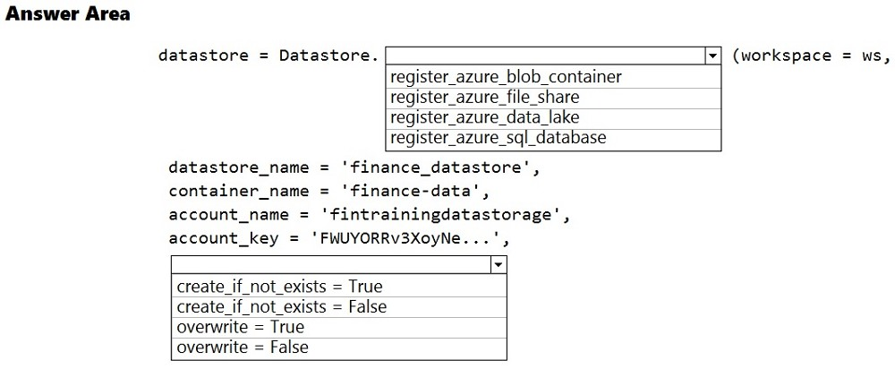
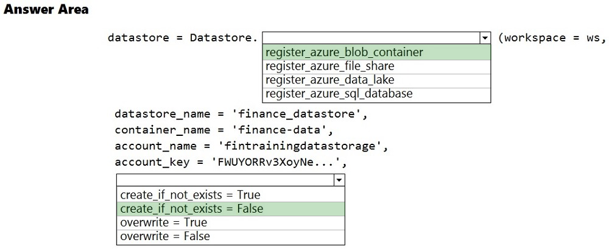

# Question 63

HOTSPOT -

The finance team asks you to train a model using data in an Azure Storage blob container named finance-data.

You need to register the container as a datastore in an Azure Machine Learning workspace and ensure that an error will be raised if the container does not exist.

How should you complete the code? To answer, select the appropriate options in the answer area.

NOTE: Each correct selection is worth one point.

Hot Area:

  
Show Suggested Answer

 

Box 1: register_azure_blob_container

Register an Azure Blob Container to the datastore.

Box 2: create_if_not_exists = False

Create the file share if it does not exist, defaults to False.

Reference:

https://docs.microsoft.com/en-us/python/api/azureml-core/azureml.core.datastore.datastore

  
Show Discussions

<blockquote>
<strong>MattAnya</strong> <code>(Thu 04 Jul 2024 05:35)</code> - <em>Upvotes: 13</em>

was on exam 01/03/2023
</blockquote>
<blockquote>
<strong>atyagi55</strong> <code>(Thu 27 Oct 2022 16:36)</code> - <em>Upvotes: 9</em>

give answer is correct.Please refer link
https://azure.github.io/azureml-sdk-for-r/reference/register_azure_blob_container_datastore.html

create_if_not_exists &quot;If TRUE, creates the blob container if it does not exists.&quot;
</blockquote>

<blockquote>
<strong>MarinaMijailovic</strong> <code>(Sun 27 Oct 2024 09:52)</code> - <em>Upvotes: 3</em>

Answer is correct. We are not creating a container, only registering it and we need an error message if it does not exist. If we set &quot;create_if_not_exists&quot; to true, it will not display the error message but create the container and we dont want that.
</blockquote>
<blockquote>
<strong>ougullamaija</strong> <code>(Thu 19 Oct 2023 20:23)</code> - <em>Upvotes: 3</em>

You can resolve this by thinking logically. overwrite = False would mean, that we don&#x27;t overwrite the existing file, but that we create a copy! create_if_not_exists = False won&#x27;t create anything if there is an existing folder.
</blockquote>
<blockquote>
<strong>azurelearner666</strong> <code>(Tue 10 Oct 2023 14:06)</code> - <em>Upvotes: 4</em>

Correct,
A: Register_azure_blob_container
B: Create_if_not_exists = False

First is easy, we are talking about storage accounts and a blob container.
Second too, It should raise an error if the container does not exist, so it should not create it in that case, as there would be no error then.
</blockquote>

<blockquote>
<strong>kkkk_jjjj</strong> <code>(Mon 18 Sep 2023 08:39)</code> - <em>Upvotes: 2</em>

on exam 18/03/2022
</blockquote>
<blockquote>
<strong>hargur</strong> <code>(Thu 20 Apr 2023 09:41)</code> - <em>Upvotes: 2</em>

on 19Oct2021
</blockquote>
<blockquote>
<strong>kisskeo</strong> <code>(Mon 03 Apr 2023 20:14)</code> - <em>Upvotes: 3</em>

On Exam 01 Oct 2021
</blockquote>
<blockquote>
<strong>mthombenindhl84</strong> <code>(Sat 11 Mar 2023 22:57)</code> - <em>Upvotes: 2</em>

on exam 11/9/2021
</blockquote>
<blockquote>
<strong>snsnsnsn</strong> <code>(Fri 03 Mar 2023 08:23)</code> - <em>Upvotes: 1</em>

on exam 2/9/21
</blockquote>
<blockquote>
<strong>dushmantha</strong> <code>(Tue 28 Feb 2023 04:51)</code> - <em>Upvotes: 1</em>

On exam 2021/08/31
</blockquote>
<blockquote>
<strong>datamijn</strong> <code>(Thu 02 Feb 2023 09:40)</code> - <em>Upvotes: 3</em>

on 2/8/2021
</blockquote>
<blockquote>
<strong>Rosh4yuh</strong> <code>(Tue 17 Jan 2023 13:50)</code> - <em>Upvotes: 2</em>

on 17/7/2021
</blockquote>
<blockquote>
<strong>ljljljlj</strong> <code>(Wed 11 Jan 2023 14:48)</code> - <em>Upvotes: 3</em>

On exam 2021/7/10
</blockquote>
<blockquote>
<strong>prashantjoge</strong> <code>(Fri 25 Nov 2022 06:04)</code> - <em>Upvotes: 2</em>

the answer does not satisfy the question
&quot;ensure that an error will be raised if the container does not exist.&quot;
</blockquote>
<blockquote>
<strong>ACSC</strong> <code>(Fri 23 Sep 2022 17:50)</code> - <em>Upvotes: 4</em>

Answer is correct. There is a mistake in the documentation. Where it says &#x27;file share&#x27;, it is &#x27;container&#x27;.
</blockquote>
<blockquote>
<strong>dev2dev</strong> <code>(Tue 13 Sep 2022 05:03)</code> - <em>Upvotes: 3</em>

2nd option should be overwrite = False create_if_not_exists is for the file share.
</blockquote>
<blockquote>
<strong>Anty85</strong> <code>(Wed 21 Sep 2022 12:16)</code> - <em>Upvotes: 4</em>

Agreed. Incredible how many wrong answers can be found here.
</blockquote>
<blockquote>
<strong>jamessnow</strong> <code>(Mon 10 Oct 2022 17:24)</code> - <em>Upvotes: 12</em>

the answer is correct don&#x27;t comment if you not sure !
</blockquote>
<blockquote>
<strong>l2azure</strong> <code>(Fri 30 Sep 2022 15:21)</code> - <em>Upvotes: 13</em>

Answer is correct, if you are not sure don&#x27;t post anything, you are adding to the confusion.
Have a look at the documentation instead:
https://docs.microsoft.com/en-us/python/api/azureml-core/azureml.core.datastore(class)?view=azure-ml-py#register-azure-blob-container-workspace--datastore-name--container-name--account-name--sas-token-none--account-key-none--protocol-none--endpoint-none--overwrite-false--create-if-not-exists-false--skip-validation-false--blob-cache-timeout-none--grant-workspace-access-false--subscription-id-none--resource-group-none-
</blockquote>

---

[<< Previous Question](question_62.md) | [Home](/index.md) | [Next Question >>](question_64.md)
