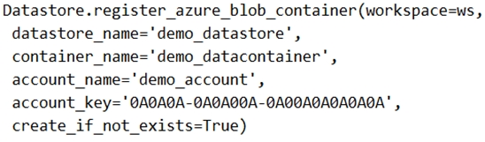
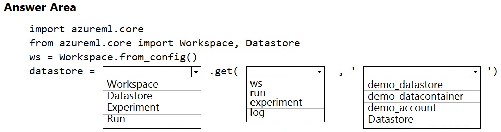
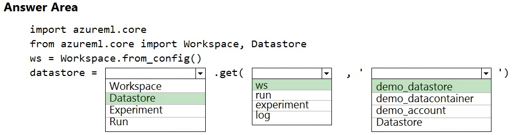

# Question 64

HOTSPOT -

A coworker registers a datastore in a Machine Learning services workspace by using the following code:

You need to write code to access the datastore from a notebook.

How should you complete the code segment? To answer, select the appropriate options in the answer area.

NOTE: Each correct selection is worth one point.

Hot Area:

  
Show Suggested Answer

 

Box 1: DataStore -

To get a specific datastore registered in the current workspace, use the get() static method on the Datastore class:

# Get a named datastore from the current workspace

datastore = Datastore.get(ws, datastore_name=&#x27;your datastore name&#x27;)

Box 2: ws -

Box 3: demo_datastore -

Reference:

https://docs.microsoft.com/en-us/azure/machine-learning/how-to-access-data

  
Show Discussions

<blockquote>
<strong>Lucario95</strong> <code>(Sun 14 Nov 2021 16:08)</code> - <em>Upvotes: 14</em>

Seems correct
</blockquote>
<blockquote>
<strong>MattAnya</strong> <code>(Tue 04 Jul 2023 05:36)</code> - <em>Upvotes: 10</em>

0n 03 Jan2023
</blockquote>
<blockquote>
<strong>thisiston</strong> <code>(Sat 02 Nov 2024 22:25)</code> - <em>Upvotes: 1</em>

Correct answer is: &#x27;Datastore&#x27;, &#x27;ws&#x27;, &#x27;blob_datastore_name&#x27;
Ex:blob_datastore = Datastore.get(ws, blob_datastore_name)
Link: https://learn.microsoft.com/en-us/python/api/azureml-core/azureml.core.datastore.datastore?view=azure-ml-py
</blockquote>
<blockquote>
<strong>k1ngs1zed</strong> <code>(Mon 17 Oct 2022 11:33)</code> - <em>Upvotes: 1</em>

answer is correct
</blockquote>
<blockquote>
<strong>kisskeo</strong> <code>(Sun 03 Apr 2022 20:24)</code> - <em>Upvotes: 2</em>

On Exam 01 Oct 2021
</blockquote>
<blockquote>
<strong>snsnsnsn</strong> <code>(Thu 03 Mar 2022 08:23)</code> - <em>Upvotes: 1</em>

on exam 2/9/21
</blockquote>
<blockquote>
<strong>datamijn</strong> <code>(Wed 02 Feb 2022 09:40)</code> - <em>Upvotes: 2</em>

on 2/8/2021
</blockquote>
<blockquote>
<strong>Rosh4yuh</strong> <code>(Mon 17 Jan 2022 13:50)</code> - <em>Upvotes: 4</em>

on 17/7/2021

Answer is correct
</blockquote>

<blockquote>
<strong>ljljljlj</strong> <code>(Tue 11 Jan 2022 14:50)</code> - <em>Upvotes: 2</em>

On exam 2021/7/10
</blockquote>
<blockquote>
<strong>okeyken1</strong> <code>(Sat 18 Dec 2021 15:27)</code> - <em>Upvotes: 4</em>

yes correct
</blockquote>

---

[<< Previous Question](question_63.md) | [Home](../index.md) | [Next Question >>](question_65.md)
