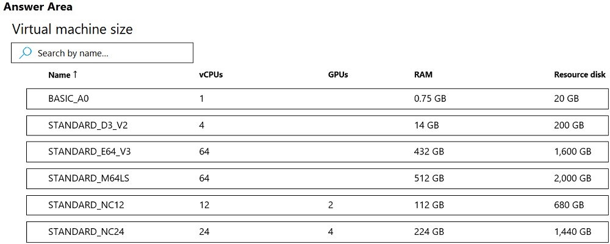
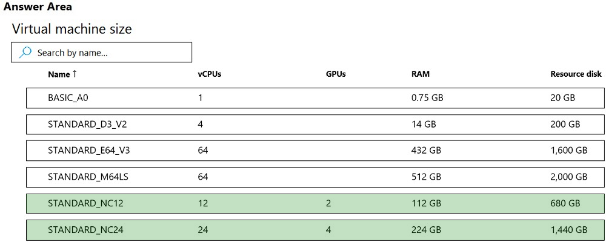

# Question 66

HOTSPOT -

You are developing a deep learning model by using TensorFlow. You plan to run the model training workload on an Azure Machine Learning Compute Instance.

You must use CUDA-based model training.

You need to provision the Compute Instance.

Which two virtual machines sizes can you use? To answer, select the appropriate virtual machine sizes in the answer area.

NOTE: Each correct selection is worth one point.

Hot Area:

  
Show Suggested Answer

 

CUDA is a parallel computing platform and programming model developed by Nvidia for general computing on its own GPUs (graphics processing units). CUDA enables developers to speed up compute-intensive applications by harnessing the power of GPUs for the parallelizable part of the computation.

Reference:

https://www.infoworld.com/article/3299703/what-is-cuda-parallel-programming-for-gpus.html

  
Show Discussions

<blockquote>
<strong>chaudha4</strong> <code>(Wed 04 May 2022 13:09)</code> - <em>Upvotes: 24</em>

In case it is not obvious, you pick the ones that support GPU since CUDA requirement is mentioned in the question.
</blockquote>
<blockquote>
<strong>jpalaci22</strong> <code>(Tue 20 Feb 2024 21:10)</code> - <em>Upvotes: 3</em>

Seen on the exam 20Feb2023
</blockquote>
<blockquote>
<strong>Oreo_Princess</strong> <code>(Fri 14 Jun 2024 17:39)</code> - <em>Upvotes: 1</em>

Hello, 
How was your experience ?
</blockquote>
<blockquote>
<strong>DodoScript</strong> <code>(Sun 20 Aug 2023 13:56)</code> - <em>Upvotes: 4</em>

Correct, you need GPU&#x27;s for CUDA
</blockquote>
<blockquote>
<strong>ljljljlj</strong> <code>(Mon 11 Jul 2022 13:51)</code> - <em>Upvotes: 3</em>

On exam 2021/7/10
</blockquote>
<blockquote>
<strong>azurecert2021</strong> <code>(Fri 24 Jun 2022 19:19)</code> - <em>Upvotes: 3</em>

given answer is correct as per below link NC series support CUDA model training.
https://docs.microsoft.com/en-us/azure/machine-learning/concept-compute-target#compute-isolation
</blockquote>
<blockquote>
<strong>shuvovertigo</strong> <code>(Sat 18 Jun 2022 21:23)</code> - <em>Upvotes: 2</em>

correct
</blockquote>
<blockquote>
<strong>SaulG</strong> <code>(Wed 08 Jun 2022 07:25)</code> - <em>Upvotes: 1</em>

Answer is Correct!
</blockquote>

---

[<< Previous Question](question_65.md) | [Home](../index.md) | [Next Question >>](question_67.md)
