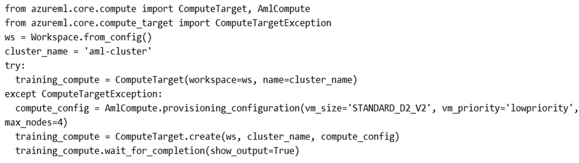
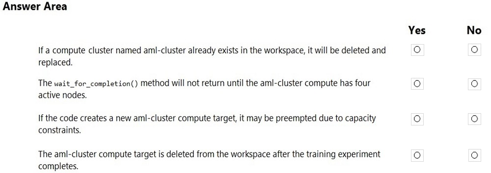
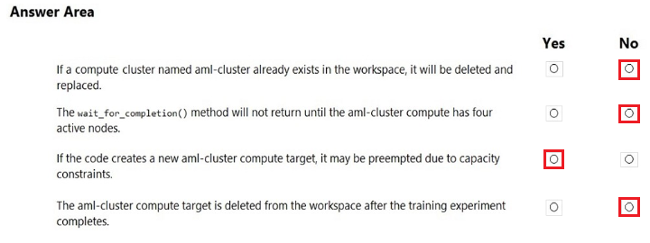

# Question 68

HOTSPOT -

You are preparing to use the Azure ML SDK to run an experiment and need to create compute. You run the following code:

For each of the following statements, select Yes if the statement is true. Otherwise, select No.

NOTE: Each correct selection is worth one point.

Hot Area:

  
Show Suggested Answer

 

  
Show Discussions

<blockquote>
<strong>iuolu</strong> <code>(Mon 01 Nov 2021 04:31)</code> - <em>Upvotes: 65</em>

The correct answer: No No Yes No
</blockquote>
<blockquote>
<strong>Edriv</strong> <code>(Wed 14 Jun 2023 08:35)</code> - <em>Upvotes: 2</em>

Correct
</blockquote>
<blockquote>
<strong>reini</strong> <code>(Thu 28 Oct 2021 14:27)</code> - <em>Upvotes: 13</em>

second answer should be no, as the here not specified parameter min_node_count defaults to &#x27;none&#x27; - see https://docs.microsoft.com/en-us/python/api/azureml-core/azureml.core.compute.amlcompute(class)?view=azure-ml-py
</blockquote>
<blockquote>
<strong>azurelearner666</strong> <code>(Mon 10 Oct 2022 15:11)</code> - <em>Upvotes: 2</em>

Exactly. Also technically it defaults to zero, so only the cluster is created and the nodes are created/added whenever they are needed.
But response is No, No, Yes, No
</blockquote>
<blockquote>
<strong>scott_klein_12345</strong> <code>(Fri 29 Oct 2021 07:30)</code> - <em>Upvotes: 1</em>

Have you looked at other questions?
Are the answers to other questions correct?
</blockquote>
<blockquote>
<strong>Ejire</strong> <code>(Sat 30 Nov 2024 13:48)</code> - <em>Upvotes: 1</em>

Answer is No NoYes No.
If you need voucher for your DP and AI exams contact me on+2348139103938
</blockquote>
<blockquote>
<strong>kel_dp_100</strong> <code>(Tue 14 May 2024 22:21)</code> - <em>Upvotes: 1</em>

the second should be Yes, from GPT
Yes, your understanding is correct. The wait_for_completion method, when called on a compute target, will wait until the specified compute target (in this case, the &#x27;aml-cluster&#x27;) has all its nodes provisioned and ready for use. The parameter show_output=True will also display detailed output while waiting, so you can monitor the progress.

So, in your specific code, it will not return until the &#x27;aml-cluster&#x27; has all four nodes provisioned and ready for use.
</blockquote>

<blockquote>
<strong>MarinaMijailovic</strong> <code>(Sat 11 Nov 2023 08:32)</code> - <em>Upvotes: 5</em>

NO NO YES NO

NO - If it doesn&#x27;t exist an exception is raised, then a new compute target is created. It doesn&#x27;t delete and replace an existing one.
NO - The wait_for_completion() method will return when the compute target is in the &#x27;Succeeded&#x27; or &#x27;Failed&#x27; provisioning state. It doesn&#x27;t specifically wait for all four nodes to become active.
YES - The compute target is being created with &#x27;lowpriority&#x27; VMs, which can be preempted if Azure needs the capacity.
NO - This code snippet does not include any code to delete the compute target after the training experiment completes.
</blockquote>

<blockquote>
<strong>Yuriy_Ch</strong> <code>(Fri 08 Sep 2023 11:09)</code> - <em>Upvotes: 2</em>

Exactly this question was on exam 07/March/2023
</blockquote>
<blockquote>
<strong>jpalaci22</strong> <code>(Sun 20 Aug 2023 20:10)</code> - <em>Upvotes: 2</em>

Seen on the exam 20Feb2023
</blockquote>
<blockquote>
<strong>turtle666</strong> <code>(Mon 10 Oct 2022 10:20)</code> - <em>Upvotes: 1</em>

training_compute created from ComputeTarget class, and wait_for_completion() not have min_node option, different from AmlCompute Class
https://docs.microsoft.com/en-us/python/api/azureml-core/azureml.core.compute.computetarget?view=azure-ml-py#azureml-core-compute-computetarget-wait-for-completion
</blockquote>
<blockquote>
<strong>Thornehead</strong> <code>(Tue 27 Sep 2022 22:46)</code> - <em>Upvotes: 3</em>

No, Yes, Yes and No.

Read the question and coding carefully.
</blockquote>

<blockquote>
<strong>kkkk_jjjj</strong> <code>(Sun 18 Sep 2022 08:39)</code> - <em>Upvotes: 2</em>

on exam 18/03/2022
</blockquote>
<blockquote>
<strong>TheYazan</strong> <code>(Fri 09 Sep 2022 20:52)</code> - <em>Upvotes: 1</em>

On march-9-2022
</blockquote>
<blockquote>
<strong>JoshuaXu</strong> <code>(Fri 06 May 2022 21:38)</code> - <em>Upvotes: 1</em>

on exam 6 Nov 2021
</blockquote>
<blockquote>
<strong>hargur</strong> <code>(Wed 20 Apr 2022 09:41)</code> - <em>Upvotes: 1</em>

on 19Oct2021
</blockquote>
<blockquote>
<strong>Rosh4yuh</strong> <code>(Mon 17 Jan 2022 13:51)</code> - <em>Upvotes: 3</em>

on 17/7/2021
</blockquote>
<blockquote>
<strong>ljljljlj</strong> <code>(Tue 11 Jan 2022 14:52)</code> - <em>Upvotes: 4</em>

On exam 2021/7/10
</blockquote>
<blockquote>
<strong>Meg04</strong> <code>(Sun 26 Dec 2021 09:44)</code> - <em>Upvotes: 1</em>

min_node_count | default value: None
Minimum number of nodes to wait for before considering provisioning to be complete. This doesn&#x27;t have to equal the minimum number of nodes that the compute was provisioned with, however it should not be greater than that.

https://docs.microsoft.com/en-us/python/api/azureml-core/azureml.core.compute.amlcompute(class)?view=azure-ml-py#wait-for-completion-show-output-false--min-node-count-none--timeout-in-minutes-25--is-delete-operation-false-
</blockquote>

<blockquote>
<strong>azurecert2021</strong> <code>(Fri 24 Dec 2021 21:03)</code> - <em>Upvotes: 4</em>

yes agree with other correct answer is No No Yes No
</blockquote>

---

[<< Previous Question](question_67.md) | [Home](/index.md) | [Next Question >>](question_69.md)
