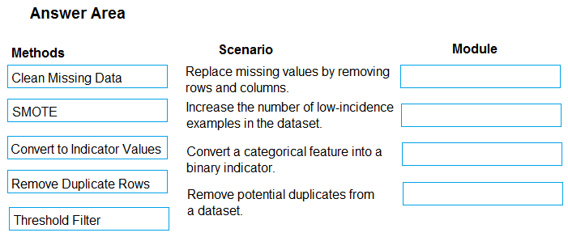

# Question 69

DRAG DROP -

You are analyzing a raw dataset that requires cleaning.

You must perform transformations and manipulations by using Azure Machine Learning Studio.

You need to identify the correct modules to perform the transformations.

Which modules should you choose? To answer, drag the appropriate modules to the correct scenarios. Each module may be used once, more than once, or not at all.

You may need to drag the split bar between panes or scroll to view content.

NOTE: Each correct selection is worth one point.

Select and Place:

  
Show Suggested Answer

 

Box 1: Clean Missing Data -

Box 2: SMOTE -

Use the SMOTE module in Azure Machine Learning Studio to increase the number of underepresented cases in a dataset used for machine learning. SMOTE is a better way of increasing the number of rare cases than simply duplicating existing cases.

Box 3: Convert to Indicator Values

Use the Convert to Indicator Values module in Azure Machine Learning Studio. The purpose of this module is to convert columns that contain categorical values into a series of binary indicator columns that can more easily be used as features in a machine learning model.

Box 4: Remove Duplicate Rows -

Reference:

https://docs.microsoft.com/en-us/azure/machine-learning/studio-module-reference/smote https://docs.microsoft.com/en-us/azure/machine-learning/studio-module-reference/convert-to-indicator-values

  
Show Discussions

<blockquote>
<strong>Tehseen</strong> <code>(Sat 24 Jun 2023 11:25)</code> - <em>Upvotes: 16</em>

Seems true
</blockquote>
<blockquote>
<strong>azurelearner666</strong> <code>(Wed 10 Apr 2024 15:03)</code> - <em>Upvotes: 6</em>

Correct!
Note that &quot;Convert to indicator values&quot; (re-encode Categorical values into binary columns) is also called One-Hot Encoding, https://docs.microsoft.com/en-us/learn/modules/prepare-data-for-machine-learning-azure-databricks/6-perform-data-encoding
</blockquote>
<blockquote>
<strong>DodoScript</strong> <code>(Tue 20 Aug 2024 13:57)</code> - <em>Upvotes: 4</em>

Answer is correct
</blockquote>
<blockquote>
<strong>k1ngs1zed</strong> <code>(Sat 13 Apr 2024 06:45)</code> - <em>Upvotes: 3</em>

Correct!
</blockquote>

---

[<< Previous Question](question_68.md) | [Home](../index.md) | [Next Question >>](question_70.md)
