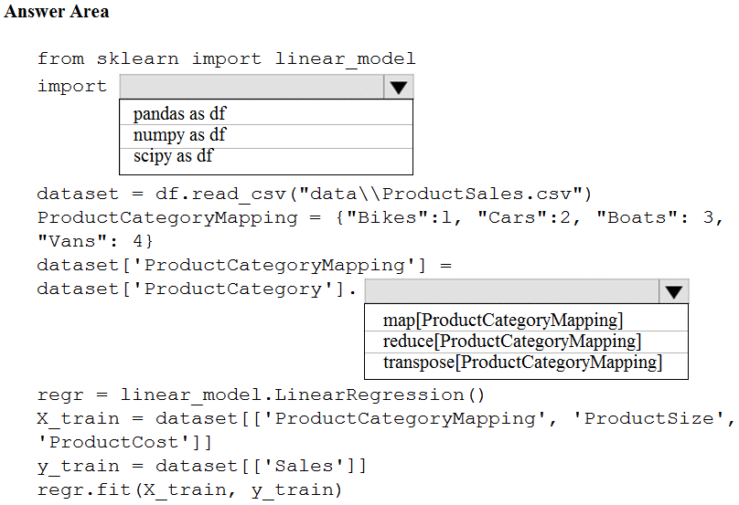
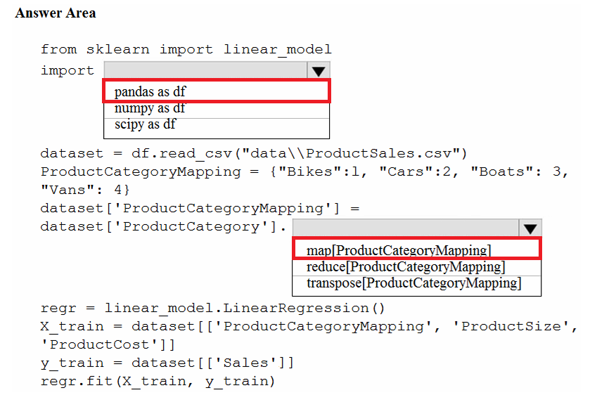

# Question 80

HOTSPOT -

You are creating a machine learning model in Python. The provided dataset contains several numerical columns and one text column. The text column represents a product's category. The product category will always be one of the following:

✑ Bikes

✑ Cars

✑ Vans

✑ Boats

You are building a regression model using the scikit-learn Python package.

You need to transform the text data to be compatible with the scikit-learn Python package.

How should you complete the code segment? To answer, select the appropriate options in the answer area.

NOTE: Each correct selection is worth one point.

Hot Area:

  
Show Suggested Answer

 

  
Show Discussions

<blockquote>
<strong>dwdas</strong> <code>(Thu 19 Nov 2020 20:07)</code> - <em>Upvotes: 90</em>

The correct answer is .map(ProductCategoryMapping). I tested it with sample code. Using transpose generates and error.
</blockquote>
<blockquote>
<strong>Cake</strong> <code>(Tue 20 Jul 2021 12:44)</code> - <em>Upvotes: 31</em>

Also, who imports pandas as df?
</blockquote>
<blockquote>
<strong>HkIsCrazY</strong> <code>(Fri 06 Aug 2021 10:10)</code> - <em>Upvotes: 3</em>

lol...same question!
</blockquote>
<blockquote>
<strong>shree12</strong> <code>(Wed 04 Sep 2024 05:30)</code> - <em>Upvotes: 1</em>

Exactly!
</blockquote>
<blockquote>
<strong>thisiston</strong> <code>(Sat 02 Nov 2024 23:48)</code> - <em>Upvotes: 2</em>

from sklearn import linear_model
import pandas as pd  # Correct import for handling data frames

# Load dataset

dataset = pd.read_csv(&quot;data\\ProductSales.csv&quot;)

# Map categories to numbers

ProductCategoryMapping = {&quot;Bikes&quot;: 1, &quot;Cars&quot;: 2, &quot;Boats&quot;: 3, &quot;Vans&quot;: 4}

# Apply the mapping

dataset[&#x27;ProductCategoryMapping&#x27;] = dataset[&#x27;ProductCategory&#x27;].map(ProductCategoryMapping)

# Initialize the regression model

regr = linear_model.LinearRegression()

# Specify the features and target variable

X_train = dataset[[&#x27;ProductCategoryMapping&#x27;, &#x27;ProductSize&#x27;, &#x27;ProductCost&#x27;]]
Y_train = dataset[&#x27;Sales&#x27;]

# Fit the model

regr.fit(X_train, Y_train)
</blockquote>

<blockquote>
<strong>sai384957324</strong> <code>(Thu 10 Oct 2024 15:54)</code> - <em>Upvotes: 1</em>

Pandas as df and map is correct
</blockquote>
<blockquote>
<strong>Lion007</strong> <code>(Sun 30 Jun 2024 19:18)</code> - <em>Upvotes: 4</em>

1. Import the pandas library to handle data frames:
import pandas as pd
2. Use the map function to convert the text categories into numerical data:
dataset[&#x27;ProductCategoryMapping&#x27;] = dataset[&#x27;ProductCategory&#x27;].map(ProductCategoryMapping)

To clear the confusion of some: Transpose is wrong. In a DataFrame, the transpose() function is used to transpose index and columns. Reflect the DataFrame over its main diagonal by writing rows as columns and vice-versa. Transposing a dataset does not convert categorical variables into a format suitable for regression analysis. This operation does not transform categorical data into a numerical format.

In contrast, the &#x27;map&#x27; function in pandas is used to match and transform values in a Series based on a given dictionary of correspondences. In the case of the product categories &#x27;Bikes&#x27;, &#x27;Cars&#x27;, &#x27;Vans&#x27;, and &#x27;Boats&#x27;, these categories are to be mapped to numerical values {1, 2, 3, 4}, as specified in the ProductCategoryMapping dictionary. The purpose of this is to transform the categorical data into a numerical format that can be understood by regression models in scikit-learn.
</blockquote>

<blockquote>
<strong>lena123</strong> <code>(Wed 21 Jun 2023 06:29)</code> - <em>Upvotes: 3</em>

The answer is map(), Transpose doesn&#x27;t transforms!!
</blockquote>
<blockquote>
<strong>ashii007</strong> <code>(Sat 25 Jun 2022 21:34)</code> - <em>Upvotes: 2</em>

map() it is. https://pandas.pydata.org/docs/reference/api/pandas.Series.map.html
</blockquote>
<blockquote>
<strong>ljljljlj</strong> <code>(Tue 11 Jan 2022 14:53)</code> - <em>Upvotes: 5</em>

On exam 2021/7/10
</blockquote>
<blockquote>
<strong>trickerk</strong> <code>(Thu 06 Jan 2022 07:39)</code> - <em>Upvotes: 2</em>

&quot;reduce&quot; or &quot;transpose&quot; will generate an error while running the code, further no brackets are allowed in the code but just parenthesis, so need to use .map() instead .map[]. Correct answer: .map
</blockquote>
<blockquote>
<strong>rishi_ram</strong> <code>(Sat 27 Nov 2021 17:38)</code> - <em>Upvotes: 3</em>

Definitely answer is .map(ProductCategoryMapping). Please run the experiment using transpose will generate error
</blockquote>
<blockquote>
<strong>scott_klein_12345</strong> <code>(Sat 30 Oct 2021 08:48)</code> - <em>Upvotes: 3</em>

import pandas as pd

salesData = pd.DataFrame({&#x27;Product&#x27;: {0: &#x27;Bikes&#x27;, 1: &#x27;Cars&#x27;, 2: &#x27;Vans&#x27;}, 2017: {0: 34, 1: 65, 2: 48}, 2018: {0: 25, 1: 76, 2: 55}})
productCategoryMapping = {&#x27;Bikes&#x27;:1, &#x27;Cars&#x27;:2, &#x27;Vans&#x27;:3}
salesData[&#x27;Mapping&#x27;] = salesData[&#x27;Product&#x27;].map(productCategoryMapping)
print(salesData)

This gives the following output -

Product 2017 2018 Mapping
0 Bikes 34 25 1
1 Cars 65 76 2
2 Vans 48 55 3

So I think A) .map is correct answer
</blockquote>

<blockquote>
<strong>wjrmffldrhrl</strong> <code>(Tue 07 Sep 2021 23:57)</code> - <em>Upvotes: 3</em>

Pandas.map() method need to lambda
</blockquote>
<blockquote>
<strong>wjrmffldrhrl</strong> <code>(Sat 11 Sep 2021 01:05)</code> - <em>Upvotes: 3</em>

Oh... I&#x27;m wrong.. I just tested it and the map is correct.
</blockquote>
<blockquote>
<strong>timotheescheurer</strong> <code>(Mon 02 Aug 2021 07:23)</code> - <em>Upvotes: 3</em>

The answer is pd.map ! I just tested it.
</blockquote>
<blockquote>
<strong>wahaha</strong> <code>(Wed 30 Jun 2021 05:27)</code> - <em>Upvotes: 4</em>

The correct answer should be .map because Transpose only works for dataframes not particular column
</blockquote>
<blockquote>
<strong>tttyyy</strong> <code>(Thu 27 May 2021 06:43)</code> - <em>Upvotes: 5</em>

Transpose is correct. As Product Catogory is categorical, it is unsuitable to be directly used in regression. Transpose translates it into 5 variables, each with value 0 and 1. Better for regression.
</blockquote>
<blockquote>
<strong>Lion007</strong> <code>(Sun 30 Jun 2024 19:12)</code> - <em>Upvotes: 1</em>

Transpose is Wrong. The justification provided for the choice of &#x27;transpose&#x27; reflects a misunderstanding. Transposing a dataset does not convert categorical variables into a format suitable for regression analysis. Transposing is a matrix operation that flips a table over its diagonal, turning rows into columns and vice versa. This operation does not transform categorical data into a numerical format.

In contrast, the &#x27;map&#x27; function in pandas is used to match and transform values in a Series based on a given dictionary of correspondences. In the case of the product categories &#x27;Bikes&#x27;, &#x27;Cars&#x27;, &#x27;Vans&#x27;, and &#x27;Boats&#x27;, these categories are to be mapped to numerical values {1, 2, 3, 4}, as specified in the ProductCategoryMapping dictionary. The purpose of this is to transform the categorical data into a numerical format that can be understood by regression models in scikit-learn.
</blockquote>

<blockquote>
<strong>SN22</strong> <code>(Sun 18 Apr 2021 20:13)</code> - <em>Upvotes: 6</em>

the second answer should be map
</blockquote>
<blockquote>
<strong>user11111</strong> <code>(Mon 01 Mar 2021 00:08)</code> - <em>Upvotes: 4</em>

The answer is Transpose, map is Used for substituting each value in a Series with another value
https://www.w3resource.com/pandas/dataframe/dataframe-transpose.php
https://www.w3resource.com/pandas/series/series-map.php
</blockquote>
<blockquote>
<strong>adamwar</strong> <code>(Mon 25 Apr 2022 13:04)</code> - <em>Upvotes: 2</em>

That&#x27;s what you want to do.
</blockquote>
<blockquote>
<strong>azurelearner666</strong> <code>(Mon 10 Oct 2022 15:42)</code> - <em>Upvotes: 1</em>

LOL... exactly! wew want to substitute the categorical text entries &quot;Bikes&quot;, &quot;Cars&quot;,... into another values 1,2,3...

Even I would have went for One-Hot Encoding as that&#x27;s the best way to do it (but not part of the question. For more info, see https://docs.microsoft.com/en-us/learn/modules/prepare-data-for-machine-learning-azure-databricks/6-perform-data-encoding)
</blockquote>

---

[<< Previous Question](question_79.md) | [Home](../index.md) | [Next Question >>](question_81.md)
