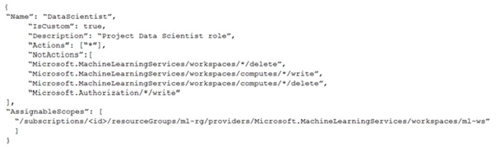
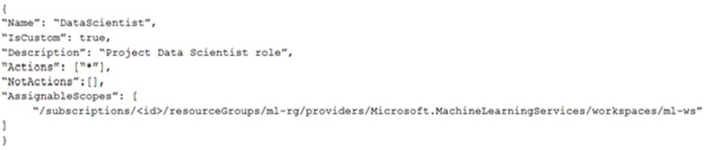
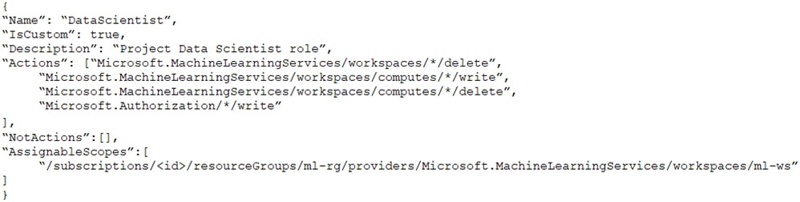
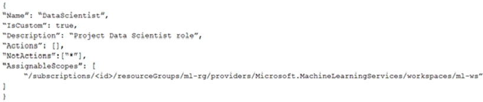

# Question 84

You create an Azure Machine Learning workspace.

You must create a custom role named DataScientist that meets the following requirements:

✑ Role members must not be able to delete the workspace.

✑ Role members must not be able to create, update, or delete compute resources in the workspace.

✑ Role members must not be able to add new users to the workspace.

You need to create a JSON file for the DataScientist role in the Azure Machine Learning workspace.

The custom role must enforce the restrictions specified by the IT Operations team.

Which JSON code segment should you use?

A.

B.

C.

D.

  
Show Suggested Answer

<strong>A</strong> 

The following custom role can do everything in the workspace except for the following actions:

✑ It can&#x27;t create or update a compute resource.

✑ It can&#x27;t delete a compute resource.

✑ It can&#x27;t add, delete, or alter role assignments.

✑ It can&#x27;t delete the workspace.

To create a custom role, first construct a role definition JSON file that specifies the permission and scope for the role. The following example defines a custom role named &quot;Data Scientist Custom&quot; scoped at a specific workspace level: data_scientist_custom_role.json :

{

&quot;Name&quot;: &quot;Data Scientist Custom&quot;,

&quot;IsCustom&quot;: true,

&quot;Description&quot;: &quot;Can run experiment but can&#x27;t create or delete compute.&quot;,

&quot;Actions&quot;: [&quot;*&quot;],

&quot;NotActions&quot;: [

&quot;Microsoft.MachineLearningServices/workspaces/*/delete&quot;,

&quot;Microsoft.MachineLearningServices/workspaces/write&quot;,

&quot;Microsoft.MachineLearningServices/workspaces/computes/*/write&quot;,

&quot;Microsoft.MachineLearningServices/workspaces/computes/*/delete&quot;,

&quot;Microsoft.Authorization/*/write&quot;

],

&quot;AssignableScopes&quot;: [

&quot;/subscriptions//resourceGroups//providers/Microsoft.MachineLearningServices/workspaces/

&quot;

]

}

Reference:

https://docs.microsoft.com/en-us/azure/machine-learning/how-to-assign-roles

  
Show Discussions

<blockquote>
<strong>MattAnya</strong> <code>(Tue 04 Jul 2023 05:39)</code> - <em>Upvotes: 9</em>

0n exam 03 Jan2023
</blockquote>
<blockquote>
<strong>ljljljlj</strong> <code>(Tue 11 Jan 2022 14:54)</code> - <em>Upvotes: 8</em>

On exam 2021/7/10
</blockquote>
<blockquote>
<strong>slash_nyk</strong> <code>(Sun 16 Jan 2022 03:31)</code> - <em>Upvotes: 8</em>

can you please share your experience. How many questions were there from this dump in the exam ?
</blockquote>
<blockquote>
<strong>Karthikat</strong> <code>(Wed 25 Sep 2024 16:41)</code> - <em>Upvotes: 2</em>

on exam 3/25/2024
</blockquote>
<blockquote>
<strong>Purplejoint</strong> <code>(Tue 08 Oct 2024 05:07)</code> - <em>Upvotes: 2</em>

Great! Would you mind sharing your experience. How many questions from this dump were there? Would appreciate.
</blockquote>
<blockquote>
<strong>NullVoider_0</strong> <code>(Mon 12 Aug 2024 13:32)</code> - <em>Upvotes: 2</em>

On exam 12-02-2024.
</blockquote>
<blockquote>
<strong>Awooga</strong> <code>(Tue 06 Aug 2024 14:15)</code> - <em>Upvotes: 1</em>

On exam 2024-02-06
</blockquote>
<blockquote>
<strong>Mal42</strong> <code>(Tue 20 Feb 2024 12:41)</code> - <em>Upvotes: 3</em>

On exam 18 Aug 2023
</blockquote>
<blockquote>
<strong>phydev</strong> <code>(Sat 20 Jan 2024 14:13)</code> - <em>Upvotes: 2</em>

On exam 20 July 2023.
</blockquote>
<blockquote>
<strong>henry_123</strong> <code>(Tue 28 Nov 2023 20:31)</code> - <em>Upvotes: 2</em>

On exam 2023-05-27
</blockquote>
<blockquote>
<strong>casper22</strong> <code>(Thu 21 Sep 2023 12:16)</code> - <em>Upvotes: 3</em>

on exam 2023-03
</blockquote>
<blockquote>
<strong>ahson0124</strong> <code>(Tue 15 Aug 2023 12:39)</code> - <em>Upvotes: 2</em>

On exam 2023-02-15
</blockquote>
<blockquote>
<strong>Edriv</strong> <code>(Wed 14 Jun 2023 12:09)</code> - <em>Upvotes: 3</em>

Option C
</blockquote>
<blockquote>
<strong>therealola</strong> <code>(Sun 18 Dec 2022 02:39)</code> - <em>Upvotes: 2</em>

Similar question on exam 18-06-22
</blockquote>
<blockquote>
<strong>racnaoamo</strong> <code>(Sat 19 Nov 2022 08:46)</code> - <em>Upvotes: 2</em>

on exam 18-5-22
</blockquote>
<blockquote>
<strong>kkkk_jjjj</strong> <code>(Sun 18 Sep 2022 08:40)</code> - <em>Upvotes: 2</em>

similar question on exam 18/03/2022
</blockquote>
<blockquote>
<strong>TheYazan</strong> <code>(Fri 09 Sep 2022 20:54)</code> - <em>Upvotes: 2</em>

Similar question on march-9-2022
</blockquote>
<blockquote>
<strong>kisskeo</strong> <code>(Mon 04 Apr 2022 20:56)</code> - <em>Upvotes: 2</em>

On Exam 01 Oct 2021
</blockquote>
<blockquote>
<strong>snsnsnsn</strong> <code>(Thu 03 Mar 2022 08:25)</code> - <em>Upvotes: 2</em>

on exam 2/9/21
</blockquote>

---

[<< Previous Question](question_83.md) | [Home](/index.md) | [Next Question >>](question_85.md)
