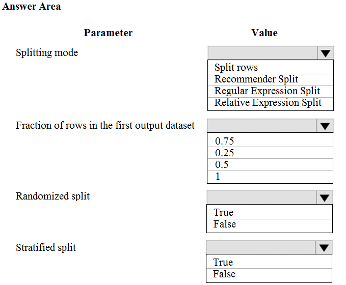
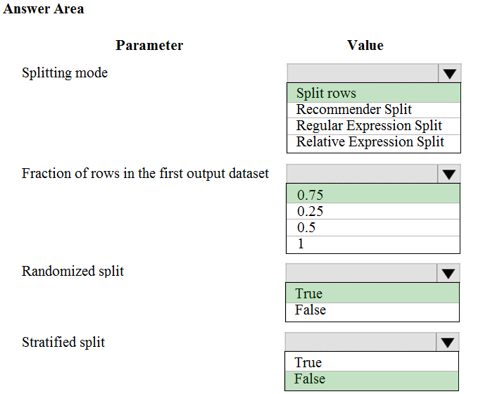

# Question 92

HOTSPOT -

You are performing a classification task in Azure Machine Learning Studio.

You must prepare balanced testing and training samples based on a provided data set.

You need to split the data with a 0.75:0.25 ratio.

Which value should you use for each parameter? To answer, select the appropriate options in the answer area.

NOTE: Each correct selection is worth one point.

Hot Area:

  
Show Suggested Answer

 

Box 1: Split rows -

Use the Split Rows option if you just want to divide the data into two parts. You can specify the percentage of data to put in each split, but by default, the data is divided 50-50.

You can also randomize the selection of rows in each group, and use stratified sampling. In stratified sampling, you must select a single column of data for which you want values to be apportioned equally among the two result datasets.

Box 2: 0.75 -

If you specify a number as a percentage, or if you use a string that contains the &quot;%&quot; character, the value is interpreted as a percentage. All percentage values must be within the range (0, 100), not including the values 0 and 100.

Box 3: Yes -

To ensure splits are balanced.

Box 4: No -

If you use the option for a stratified split, the output datasets can be further divided by subgroups, by selecting a strata column.

Reference:

https://docs.microsoft.com/en-us/azure/machine-learning/studio-module-reference/split-data

  
Show Discussions

<blockquote>
<strong>Yong2020</strong> <code>(Thu 20 May 2021 09:56)</code> - <em>Upvotes: 66</em>

Stratified split should be true in order to be balanced
</blockquote>
<blockquote>
<strong>snegnik</strong> <code>(Wed 22 May 2024 19:06)</code> - <em>Upvotes: 4</em>

Stratified split - TRUE

Stratified split: Set this option to True to ensure that the two output datasets contain a representative sample of the values in the strata column or stratification key column.

With stratified sampling, the data is divided such that each output dataset gets roughly the same percentage of each target value. For example, you might want to ensure that your training and testing sets are roughly balanced with regard to the outcome or to some other column (such as gender).

https://learn.microsoft.com/en-us/azure/machine-learning/component-reference/split-data?view=azureml-api-2
</blockquote>

<blockquote>
<strong>JUEI</strong> <code>(Mon 26 Jul 2021 03:53)</code> - <em>Upvotes: 6</em>

Would tend to go with this answer too, cause it doesn&#x27;t make sense that randomize split could ensure testing and training samples are balanced, since it perform &quot;randomize selection&quot;, saying there might be possibility that some targeted values might happen to have more/less than the other.
</blockquote>
<blockquote>
<strong>SnowCheetah</strong> <code>(Sat 25 Jun 2022 14:16)</code> - <em>Upvotes: 3</em>

I agree https://docs.microsoft.com/en-us/azure/machine-learning/algorithm-module-reference/split-data
</blockquote>
<blockquote>
<strong>dija123</strong> <code>(Sun 18 Dec 2022 14:04)</code> - <em>Upvotes: 2</em>

Totally agree
</blockquote>
<blockquote>
<strong>Andrexx</strong> <code>(Fri 12 Nov 2021 21:53)</code> - <em>Upvotes: 13</em>

In my opinion, stratified split should be true.
Based on this: &quot;Stratified split: Set this option to True to ensure that the two output datasets contain a representative sample of the values in the strata column or stratification key column.

With stratified sampling, the data is divided such that each output dataset gets roughly the same percentage of each target value. For example, you might want to ensure that your training and testing sets are roughly balanced with regard to the outcome, or with regard to some other column such as gender.&quot;

https://docs.microsoft.com/en-us/azure/machine-learning/studio-module-reference/split-data-using-split-rows
</blockquote>

<blockquote>
<strong>PI_Team</strong> <code>(Fri 12 Jul 2024 16:14)</code> - <em>Upvotes: 5</em>

When performing data splitting, especially in scenarios where there is an imbalance in the distribution of certain categories or groups within a column, using a strata column can be beneficial. By grouping the rows based on the strata column, it helps ensure that each subset (e.g., training or testing) maintains a similar representation of the different categories or groups present in the strata column.

so Stratified split - TRUE

SaM
</blockquote>

<blockquote>
<strong>MohammadKhubeb</strong> <code>(Thu 02 Feb 2023 02:00)</code> - <em>Upvotes: 3</em>

Stratified split should be FALSE, because it is not the IMBALANCE DATASET. Please refer this: Chawla, Nitesh V., et al. &quot;SMOTE: synthetic minority over-sampling technique.&quot; Journal of Artificial Intelligence Research 16 (2002): 321-357.
</blockquote>
<blockquote>
<strong>azure1000</strong> <code>(Thu 04 Aug 2022 08:51)</code> - <em>Upvotes: 1</em>

In a classification setting, it is often chosen to ensure that the train and test sets have approximately the same percentage of samples of each target class as the complete set.

As a result, if the data set has a large amount of each class, stratified sampling is pretty much the same as random sampling. But if one class isn&#x27;t much represented in the data set, which may be the case in your dataset since you plan to oversample the minority class, then stratified sampling may yield a different target class distribution in the train and test sets than what random sampling may yield.
</blockquote>

<blockquote>
<strong>azure1000</strong> <code>(Thu 04 Aug 2022 08:50)</code> - <em>Upvotes: 1</em>

In a classification setting, it is often chosen to ensure that the train and test sets have approximately the same percentage of samples of each target class as the complete set.

As a result, if the data set has a large amount of each class, stratified sampling is pretty much the same as random sampling. But if one class isn&#x27;t much represented in the data set, which may be the case in your dataset since you plan to oversample the minority class, then stratified sampling may yield a different target class distribution in the train and test sets than what random sampling may yield.
</blockquote>

<blockquote>
<strong>Lucario95</strong> <code>(Sat 11 Jun 2022 07:41)</code> - <em>Upvotes: 3</em>

I think Stratified split should be set to True for balancing the 2 subsets, no info about Random Splitting True/False though...
</blockquote>
<blockquote>
<strong>Padilha</strong> <code>(Fri 19 Jan 2024 22:25)</code> - <em>Upvotes: 1</em>

Normally you don&#x27;t need to stratify if the dataset is balanced. It&#x27;s the same in sklearn
</blockquote>
<blockquote>
<strong>rishi_ram</strong> <code>(Thu 02 Jun 2022 07:23)</code> - <em>Upvotes: 1</em>

Based on below requirement I would say Stratified Split should be false
Additional requirements for stratified sampling:
The strata column can contain only nominal or categorical data. If the column contains continuous numeric data, an error message is raised.

A column with too many unique values is not a good candidate for stratification. You might try collapsing some categories or grouping values beforehand.
</blockquote>

<blockquote>
<strong>Tusharsp</strong> <code>(Sun 08 May 2022 03:35)</code> - <em>Upvotes: 10</em>

Contrary to all comments here, stratified split should be False. For it to be set to true, we need to select the column for which data needs to be stratified. There is no mention of any column in the question. In this scenario just saying select it to True does not make sense. Also for people following documentation, here is the extract.

Stratified split: Set this option to True to ensure that the two output datasets contain a representative sample of the values in the strata column or stratification key column.
With stratified sampling, the data is divided such that each output dataset gets roughly the same percentage of each target value. For example, you might want to ensure that your training and testing sets are roughly balanced with regard to the outcome or to some other column (such as gender).
</blockquote>

<blockquote>
<strong>poons</strong> <code>(Mon 28 Mar 2022 16:30)</code> - <em>Upvotes: 3</em>

Since, the dataset is balanced, Stratified split = False might work.
</blockquote>
<blockquote>
<strong>PremPatrick</strong> <code>(Sat 18 Nov 2023 07:27)</code> - <em>Upvotes: 1</em>

Didnt say it is balanced... said you have to balance it
</blockquote>
<blockquote>
<strong>saurabhk1</strong> <code>(Sat 05 Mar 2022 10:14)</code> - <em>Upvotes: 2</em>

I too think Stratified should be set to True.
</blockquote>
<blockquote>
<strong>Paa_Kwesi</strong> <code>(Fri 03 Dec 2021 12:00)</code> - <em>Upvotes: 6</em>

stratified split should be set to True
With stratified sampling, the data is divided such that each output dataset gets roughly the same percentage of each target value. For example, you might want to ensure that your training and testing sets are roughly balanced with regard to the outcome, or with regard to some other column such as gender.
https://docs.microsoft.com/en-us/azure/machine-learning/studio-module-reference/split-data-using-split-rows
</blockquote>
<blockquote>
<strong>DanielGP</strong> <code>(Thu 27 Jan 2022 12:06)</code> - <em>Upvotes: 2</em>

You are absolutely right. For &quot;balanced&quot; set -&gt; &quot;Stratified&quot; must be true
</blockquote>
<blockquote>
<strong>Pucha</strong> <code>(Fri 12 Nov 2021 05:45)</code> - <em>Upvotes: 2</em>

Stratified should be true
</blockquote>
<blockquote>
<strong>podval</strong> <code>(Wed 07 Jul 2021 22:40)</code> - <em>Upvotes: 4</em>

Stratified means UNbalanced as it keeps the ratio between classes. That is why it needs to be set to False.
</blockquote>
<blockquote>
<strong>dev2dev</strong> <code>(Sun 20 Mar 2022 07:30)</code> - <em>Upvotes: 3</em>

where did you get the meaning of stratified is unbalanced? strata means layers/groups. in ML we do stratify data to make sure the data balance is maintained.
</blockquote>
<blockquote>
<strong>Gitty</strong> <code>(Fri 13 Aug 2021 09:18)</code> - <em>Upvotes: 2</em>

Correct. Stratified should be False.
</blockquote>
<blockquote>
<strong>kath3624</strong> <code>(Tue 29 Jun 2021 20:19)</code> - <em>Upvotes: 8</em>

because of balanced testing and training samples, Statisfied should be set to True. https://docs.microsoft.com/en-us/azure/machine-learning/studio-module-reference/split-data-using-split-rows
</blockquote>
<blockquote>
<strong>jsnels86</strong> <code>(Wed 26 May 2021 15:54)</code> - <em>Upvotes: 4</em>

Stratified split is correct here
</blockquote>
<blockquote>
<strong>ajithvajrala</strong> <code>(Sun 23 May 2021 11:30)</code> - <em>Upvotes: 6</em>

I too think Statified should be set to True
</blockquote>

---

[<< Previous Question](question_91.md) | [Home](/index.md) | [Next Question >>](question_93.md)
