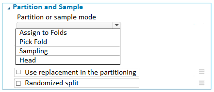
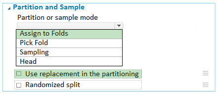

# Question 93

HOTSPOT -

You have a dataset that contains 2,000 rows. You are building a machine learning classification model by using Azure Learning Studio. You add a Partition and

Sample module to the experiment.

You need to configure the module. You must meet the following requirements:

✑ Divide the data into subsets

✑ Assign the rows into folds using a round-robin method

✑ Allow rows in the dataset to be reused

How should you configure the module? To answer, select the appropriate options in the dialog box in the answer area.

NOTE: Each correct selection is worth one point.

Hot Area:

  
Show Suggested Answer

 

Use the Split data into partitions option when you want to divide the dataset into subsets of the data. This option is also useful when you want to create a custom number of folds for cross-validation, or to split rows into several groups.

1. Add the Partition and Sample module to your experiment in Studio (classic), and connect the dataset.

2. For Partition or sample mode, select Assign to Folds.

3. Use replacement in the partitioning: Select this option if you want the sampled row to be put back into the pool of rows for potential reuse. As a result, the same row might be assigned to several folds.

4. If you do not use replacement (the default option), the sampled row is not put back into the pool of rows for potential reuse. As a result, each row can be assigned to only one fold.

5. Randomized split: Select this option if you want rows to be randomly assigned to folds.

If you do not select this option, rows are assigned to folds using the round-robin method.

Reference:

https://docs.microsoft.com/en-us/azure/machine-learning/studio-module-reference/partition-and-sample

  
Show Discussions

<blockquote>
<strong>phdykd</strong> <code>(Mon 05 Aug 2024 00:42)</code> - <em>Upvotes: 3</em>

A. Assign to Folds: To divide the data into subsets and assign the rows into folds using a round-robin method.
E. Use replacement in the partitioning: To allow the same row to be assigned to multiple folds.
</blockquote>
<blockquote>
<strong>phdykd</strong> <code>(Mon 05 Aug 2024 00:40)</code> - <em>Upvotes: 3</em>

A. Assign to Folds: To divide the data into subsets and assign the rows into folds using a round-robin method.
C. Sampling: To allow rows in the dataset to be reused.
E. Use replacement in the partitioning: To allow the same row to be assigned to multiple folds.
</blockquote>
<blockquote>
<strong>ajay0011</strong> <code>(Thu 03 Oct 2024 00:32)</code> - <em>Upvotes: 2</em>

you are wrong given answer is correct, i have checked the module in designer
</blockquote>
<blockquote>
<strong>synapse</strong> <code>(Wed 13 Sep 2023 09:32)</code> - <em>Upvotes: 4</em>

The given answer is correct.
</blockquote>
<blockquote>
<strong>MohammadKhubeb</strong> <code>(Thu 03 Aug 2023 00:08)</code> - <em>Upvotes: 1</em>

It is Randomized split because of Round Robin.
</blockquote>
<blockquote>
<strong>David_Tadeu</strong> <code>(Tue 26 Sep 2023 07:40)</code> - <em>Upvotes: 6</em>

You mean Randomized_split is unchecked because of Round Robin
</blockquote>
<blockquote>
<strong>Narendra05</strong> <code>(Mon 26 Dec 2022 14:31)</code> - <em>Upvotes: 2</em>

The Data to divide into fold is already mentioned that option is correct .
</blockquote>
<blockquote>
<strong>parwa</strong> <code>(Tue 03 Jan 2023 01:52)</code> - <em>Upvotes: 9</em>

1. Assign to Folds
2.  use Replacement in the partition - Checked
3. Randomized split- unchecked
</blockquote>
<blockquote>
<strong>YipingRuan</strong> <code>(Wed 25 Jan 2023 14:50)</code> - <em>Upvotes: 10</em>

Randomized split: Select this option if you want rows to be randomly assigned to folds.

If you do not select this option, rows are assigned to folds using the round-robin method.
</blockquote>

---

[<< Previous Question](question_92.md) | [Home](/index.md) | [Next Question >>](question_94.md)
