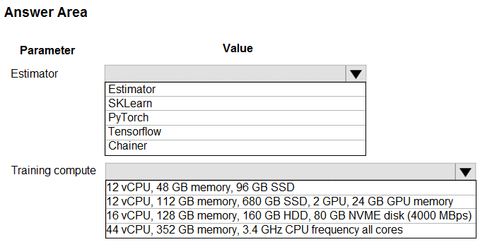
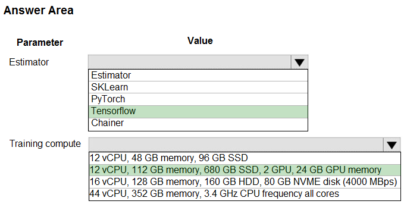

# Question 96

HOTSPOT -

You create an Azure Machine Learning workspace and set up a development environment. You plan to train a deep neural network (DNN) by using the

Tensorflow framework and by using estimators to submit training scripts.

You must optimize computation speed for training runs.

You need to choose the appropriate estimator to use as well as the appropriate training compute target configuration.

Which values should you use? To answer, select the appropriate options in the answer area.

NOTE: Each correct selection is worth one point.

Hot Area:

  
Show Suggested Answer

 

Box 1: Tensorflow -

TensorFlow represents an estimator for training in TensorFlow experiments.

Box 2: 12 vCPU, 112 GB memory..,2 GPU,..

Use GPUs for the deep neural network.

Reference:

https://docs.microsoft.com/en-us/python/api/azureml-train-core/azureml.train.dnn

  
Show Discussions

<blockquote>
<strong>MarinaMijailovic</strong> <code>(Fri 31 May 2024 12:37)</code> - <em>Upvotes: 1</em>

How do you know which training compute to choose? There are so many details. How to know in general what are the best options?
</blockquote>
<blockquote>
<strong>lcgcastro96</strong> <code>(Thu 13 Jun 2024 14:09)</code> - <em>Upvotes: 5</em>

TensorFlow will normally require GPU for faster computation times, the only machine there with GPU is the solution chosen one
</blockquote>
<blockquote>
<strong>PremPatrick</strong> <code>(Sun 12 Nov 2023 06:43)</code> - <em>Upvotes: 1</em>

Why not Pytorch as option?
</blockquote>
<blockquote>
<strong>RicSpd</strong> <code>(Thu 23 Nov 2023 13:53)</code> - <em>Upvotes: 6</em>

Because it is written &quot;by using the Tensorflow framework&quot;
</blockquote>
<blockquote>
<strong>AjoseO</strong> <code>(Sun 19 Feb 2023 12:45)</code> - <em>Upvotes: 4</em>

Correct! DNN frameworks include TensorFlow and Pytorch, and works best with GPU!
</blockquote>
<blockquote>
<strong>renuka1234</strong> <code>(Fri 09 Dec 2022 08:50)</code> - <em>Upvotes: 4</em>

Correct
</blockquote>

---

[<< Previous Question](question_95.md) | [Home](../index.md) | [Next Question >>](question_97.md)
